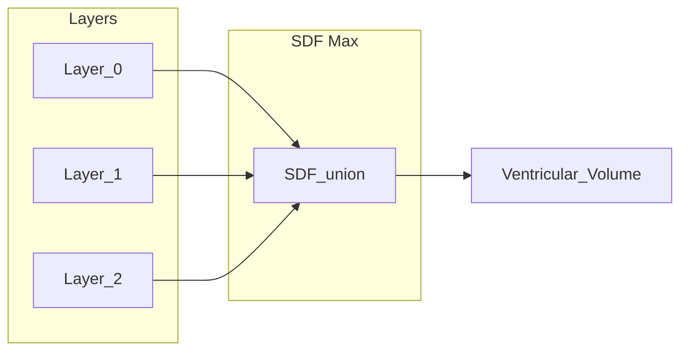

# Fourth-Dimensional Spatial Generators: Time, Narrative, and Visual Representation

Design document for extending spatial generation into time, placing narrative and calendar actions in (x,y,z,t), and visualizing causal structure and pathfinding coverage with SDF-based volumes and layered emergence display.

---

## 1. Scope and goals

Extend spatial generation (e.g. BedogaGenerator's 2D/3D placement) into **time** so that:

- **Narrative nodes** and **calendar actions** (e.g. `NarrativeCalendarEvent`, `NarrativePlaySoundNode`, `NarrativeExecutor`) can be **placed** in a unified (x, y, z, t) space.
- **Triggers** like "when a character enters a room" are modeled as **spatiotemporal** conditions: (region × time window) rather than time-only or space-only.
- **Encoding** time for spawning narrative features and emergent gameplay stays simple in data and logic.
- **Visualization** of this 4D structure is addressed via **SDF-based volumes** and **gizmo/volume rendering** so causal structure and time's effect on sound, physics, and UI (dialogue, menus) can be inspected and tuned.

Existing pieces to integrate: `NarrativeCalendarAsset`, `NarrativeScheduler`, `NarrativeExecutor`, `NarrativeContingency`, and spatial generators (Quad/Oct trees, placement queues). Temporal placement strategies (Section 5), pathfinding SDF coverage (Section 6), and emergence visualization (Section 8) extend this foundation.

---

## 2. Why "fourth dimension" for narrative and calendar

Today:

- **Space** is handled by spatial solvers (QuadTree/OctTree, placement bounds, SceneTree hierarchy).
- **Time** is handled by narrative/calendar (e.g. `NarrativeClock`, `NarrativeDateTime`, events with `startDateTime` / `durationSeconds`).
- **Triggers** like "play sound when entering a room" are either purely temporal (scheduler fires at a time) or purely spatial (e.g. trigger collider), with no single representation that is "this narrative action lives in this region at this time."

A **4D spatial generator** treats **(x, y, z, t)** as one space:

- **Placement** chooses not only *where* (x,y,z) but *when* (t) a narrative node or calendar action is "active" or triggerable.
- **Queries** become "what narrative/calendar content overlaps this (region, time window)?"
- **Causality** (e.g. "event A enables event B") can be modeled as directed links in (space, time), which then drives both **encoding** and **visualization** (causal trees as gradient volumes; see Sections 6 and 8).

---

## 3. Encoding time in a spatial context

### 3.1 Data model

- **4D bounds:** `Bounds4` or equivalent: (min.x,y,z,t, max.x,y,z,t) or center + size in 4D.
- **Narrative / calendar "volumes":** Each narrative node or calendar action has an optional **spatiotemporal volume**: spatial region in world or local space; temporal window [t_start, t_end] in narrative time.
- **Placement:** The 4D generator places "narrative objects" in (x,y,z,t) using occupancy trees and collision in 4D; **temporal placement strategy** (Section 5) defines the order in which time slots are chosen.

### 3.2 Triggers (e.g. "when character enters room")

- **Enter room** = spatial event (character bounds intersect room bounds).
- **Calendar action** = temporal event (clock ≥ event start).
- **"Play sound when character enters room"** = conjunction: (character in room) ∧ (clock in event window) ∧ (contingency conditions). The same calendar event can be bound to a **region** and a **time window**; the executor/scheduler evaluates both. **Schedule buffer and padding** (Section 5) constrain when events are considered active at boundaries.

### 3.3 Emergence

- **Spawning narrative features:** A 4D generator places narrative nodes in (x,y,z,t). Emergence comes from rules that generate new (region, time_window) volumes from existing ones, and from runtime queries over 4D occupancy. **Emergence visualization** (Section 8) encodes this as layered ventricular SDF max display.

---

## 4. Why visualizing time is hard

- Screens and viewports are 2D (or 3D); time is usually shown as a separate axis (timeline) or not at all.
- Causal structure (which event enables which) is graph-like; placing it in (x,y,z,t) without a clear convention looks messy.
- Density: many narrative nodes in a small (region, time) look like a blob unless we use layers (by event type, character) or abstraction (volumes instead of points).

So the goal is not to "draw 4D literally" but to show **where** (in space) narrative/calendar content lives, **when** it's active (time axis or color/opacity as time), and **causal/temporal structure** in a readable way. SDF max shapes, gradient volumes, pathfinding coverage (Section 6), and layered emergence (Section 8) address this.

---

## 5. Temporal placement strategies and schedule buffer/padding

Parallel to spatial placement strategy (e.g. `PlacementStrategy.UniformQueue` / `Immediate` in `SpatialGenerator`), temporal events need an **order** in which (region, time_window) slots are chosen for narrative/calendar placement. The following strategies define that order; **schedule buffer** and **padding** define constraints on slots.

### 5.1 Placement strategies for temporal events

| Strategy | Description | Use case |
|----------|-------------|----------|
| **Chronological** | Process events by `startDateTime` ascending (earliest first). | Default for "play in time order." |
| **Reverse chronological** | Latest first. | "Fill from deadline backward," undo, or preview. |
| **Head/tail back-and-forth** | Alternate between earliest and latest (head, then tail, then next head, next tail). | Spreads placement across the timeline; avoids clustering at one end. |
| **Division by X** | Split the time range into X buckets (e.g. by hour or narrative act); process bucket 0, 1, …, X-1, or round-robin. | Ensures coverage across the timeline. |
| **Custom / priority queue** | Events carry a priority or slot index; process by priority then by time (or vice versa). | Narrative-critical events placed first. |

These strategies plug into a 4D generator by defining the **order** in which temporal (or spatiotemporal) slots are offered when placing narrative/calendar content. The same event set can produce different layouts (e.g. more uniform vs. clustered) depending on strategy.

### 5.2 Schedule buffer

- **Definition:** Minimum gap (in narrative time) between the **end** of one event's time window and the **start** of another's when placing or validating.
- **Purpose:** Prevents overlapping "narrative occupancy" unless explicitly allowed; avoids accidental stacking of events in the same time slot.
- **Implementation:** When allocating or validating a new event's window, ensure `new_start >= previous_end + buffer` (or configurable per pair).

### 5.3 Schedule padding

- **Definition:** Inset from the nominal start/end of an event's window. The event is considered "active" from `start + padding` to `end - padding`.
- **Purpose:** Soft edges, fade-in/out, or safe zones so triggers don't fire exactly on the boundary; avoids edge-case timing bugs.
- **Implementation:** When evaluating "is this event active at time t?", use the padded interval; when displaying or editing, the nominal window can still be shown with padding as a visual inset.

Together, buffer and padding define **constraints** on (region, time_window) slots and make placement and triggering behavior predictable and editable.

---

## 6. SDF max shapes and gradient volumes (causal structure and pathfinding)

### 6.1 SDF (signed distance field) in 4D

- In 3D, an SDF gives per-voxel distance to a surface (negative inside, positive outside). In **4D**, the same idea: a scalar field φ(x,y,z,t) where φ < 0 = "inside" a narrative volume, φ = 0 = boundary.
- **Max of SDFs:** Taking **max(φ₁, φ₂, …)** over several narrative volumes gives a **combined** narrative occupancy in 4D. Supports queries ("Is (player_region, now) inside any narrative volume?") and placement ("Where is there free 4D space?").

### 6.2 Causal trees as gradient volumes

- A **narrative causal tree** is a DAG: nodes = events, edges = "A enables B."
- **Gradient volume:** In a 4D grid (or 3D + time slices), assign each cell a value encoding **distance along the causal structure** (e.g. depth from root, or earliest time at which this (x,y,z) is affected). Color or opacity = that value (e.g. gradient from past to future in causal order). Slicing at a fixed t gives a 3D slice of "narrative influence at that time."

### 6.3 SDF max coverage for pathfinding ("where could the cat go")

- **Reachable space over time:** For a given agent (e.g. "cat") and optional time window, compute or approximate the set of (x, y, z) [and optionally t] that the agent can reach (pathfinding or propagation).
- **SDF max** over multiple possible paths or samples: union of reachable regions into a single **coverage volume**. Renders as a 3D (or 3D slice of 4D) volume in the editor.
- This is the **spatial representation** of "where the agent could go" and can feed narrative placement (e.g. "place event where the cat could be").

### 6.4 Display modes for pathfinding and placement

| Mode | Description |
|------|-------------|
| **Statistical likelihood** | Color or opacity by probability of being at that cell (e.g. from many path samples or a diffusion model). Gradient from low to high likelihood. |
| **Fitness** | Color by cost-to-reach, heuristic score, or "fitness" (e.g. distance to goal, accessibility). Gradient shows best-to-worst or cheapest-to-most-expensive. |
| **Possible placement** | Binary or soft "can place here" for narrative/objects—regions where placement is valid given constraints (navmesh, collision, narrative volume). Supports both pathfinding and 4D narrative placement display. |

### 6.5 Causal display (narrative lead-in and connections)

- Use the same pathfinding/coverage display pipeline to show **narrative lead-in** and **connections between nodes**.
- Visual treatments: **dotted lines**, **stripes**, or **pokedots** (stippling) along edges or over regions to represent causal links (e.g. "event A enables B") or narrative flow.
- Overlay on the SDF max or gradient volume so that "where the cat could go" and "how narrative nodes connect" are visible together without clutter.

---

## 7. Effects of time on sound, physics, and gameplay

- **Sound:** Calendar/narrative time gates *when* a sound can play; 4D adds "only when (listener_region, now) is inside this narrative volume." Optionally use the same 4D SDF for attenuation or reverb by (position, time).
- **Physics:** Time windows can enable/disable rigidbodies, constraints, or ragdoll in certain (region, t). At runtime, query 4D volume at (object_region, now) and apply overrides.
- **Dialogue and menus:** Each option or menu entry is "placed" in (region, time). When the player is in that region and narrative time is in that window, the option is available; otherwise hidden or disabled.

All of these can share one **4D query API**: sample narrative/calendar occupancy and causal gradient at (x,y,z,t); sound, physics, and UI systems interpret the result.

---

## 8. Emergence visualization: layered ventricular 3D SDF max

### 8.1 Concept

Encode **emergence** (new possibilities appearing over time or as a result of prior events) as a **layered, ventricular-style** 3D SDF max visualization.

### 8.2 Sweet-potato metaphor

- The volume **grows** over time (or over causal steps) like a sweet potato: **new sections protrude** with **distinct colors** (e.g. each causal layer or time band has its own color).
- **Transparent layers underneath:** Older layers remain visible but more transparent; newer layers more opaque. You see "each section could reach a given place" and "the layers imply possibility / existence."

### 8.3 Technical sketch

- Each **layer** = one SDF (or one time slice / one causal rank). Combine with **SDF max** (union). Render with **per-layer color and opacity** (e.g. layer 0 = 20% opacity, layer 1 = 40%, …; or gradient by time/causal depth).
- Result: a single 3D volume (or 3D slice of 4D) that looks like an organic, bulbous shape with colored lobes and transparent interior, suggesting "this is the space of what could happen / what exists."

### 8.4 Connection to emergence

- New narrative or pathfinding possibilities "grow" as new lobes; the layered, transparent view makes it clear that earlier possibilities still exist underneath and that new ones extend the volume.
- Use for **narrative causal trees** (each layer = a branch or time band) and for **pathfinding coverage** (each layer = a time step or a path sample).

---

## 9. Implementation order

1. **Data:** Add optional Bounds4 or (region + time_window) to narrative/calendar entities; keep existing execution as-is.
2. **4D generator:** Design 4D occupancy structure (e.g. 3D OctTree per time slice, or 4D tree) and placement rules that respect narrative causality.
3. **Temporal strategies:** Implement chronological, head/tail, division-by-X, priority; add schedule buffer and padding to placement and validation.
4. **Triggers:** Extend scheduler/executor so "when character enters room" = spatial + temporal predicate; hook calendar actions to 4D volumes.
5. **SDF / gradient:** Precompute SDF max and causal gradient on a 4D grid (or 3D + time); expose query API.
6. **Pathfinding coverage:** Implement "where could the cat go" SDF max and display modes (likelihood, fitness, possible placement); add causal display (dotted lines, stripes, pokedots).
7. **Gizmos:** Draw 3D slices at current or selected t, time axis, causal gradient color, and layered ventricular volume; keep cost low (LOD, update on change).
8. **Emergence visualization:** Render layered ventricular 3D SDF max with per-layer color and opacity.
9. **Orchestration component:** Management component that allows easy flag selection / bitmask checkbox fields.

---

## 10. Relation to current systems

- **BedogaGenerator:** Remains the source of **spatial** layout (rooms, walls, table, sign). A 4D layer adds a time dimension and can attach narrative nodes and calendar actions to placed regions and time windows; **temporal placement strategy** (Section 5) applies when placing in time.
- **NarrativeCalendarAsset / NarrativeScheduler / NarrativeExecutor:** Events and actions gain optional (region, time_window); scheduler/executor consider both clock time and "player in region"; buffer and padding apply at boundaries.
- **NarrativeContingency:** Conditions can include "inside narrative volume (region, t)" so contingencies are spatiotemporal.
- **Pathfinding:** SDF max coverage (Section 6) and emergence layers (Section 8) can consume or drive the same navmesh/pathfinding data for "where could the cat go" and possible placement display.
