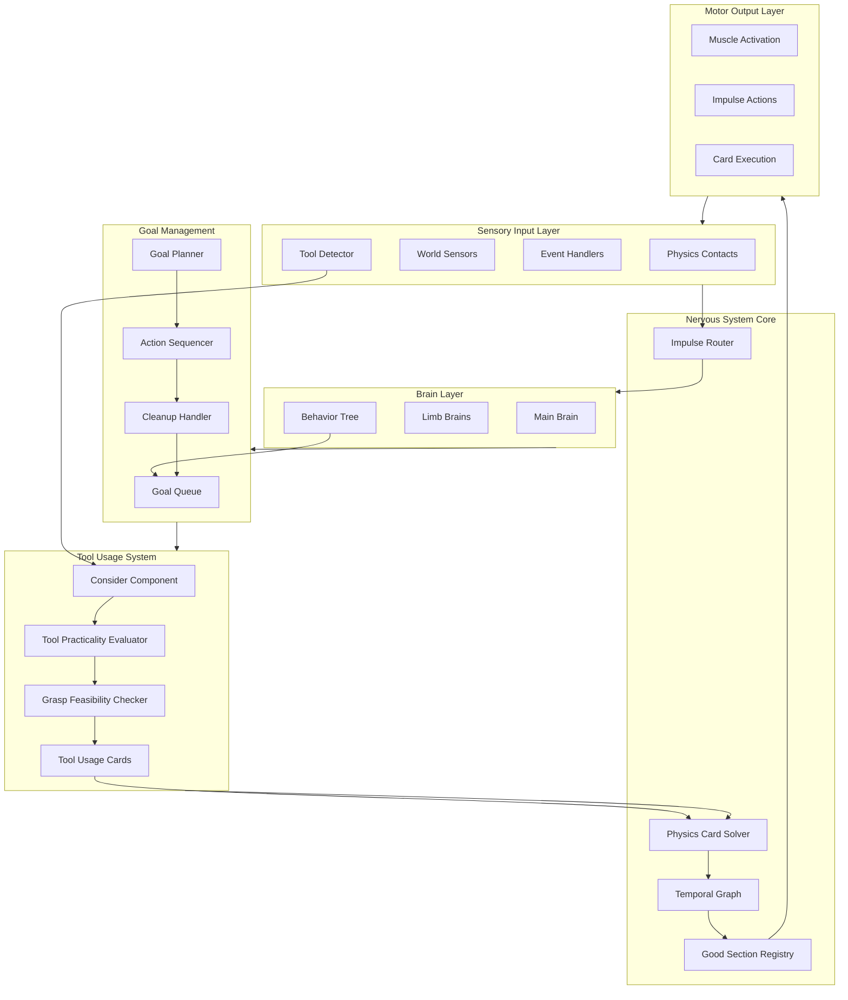
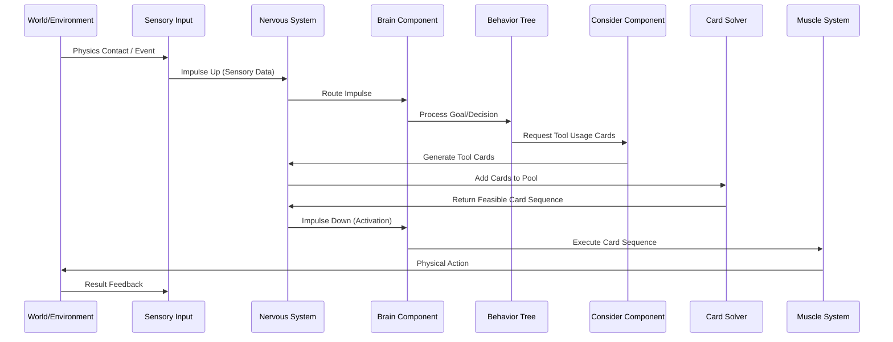
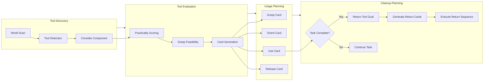
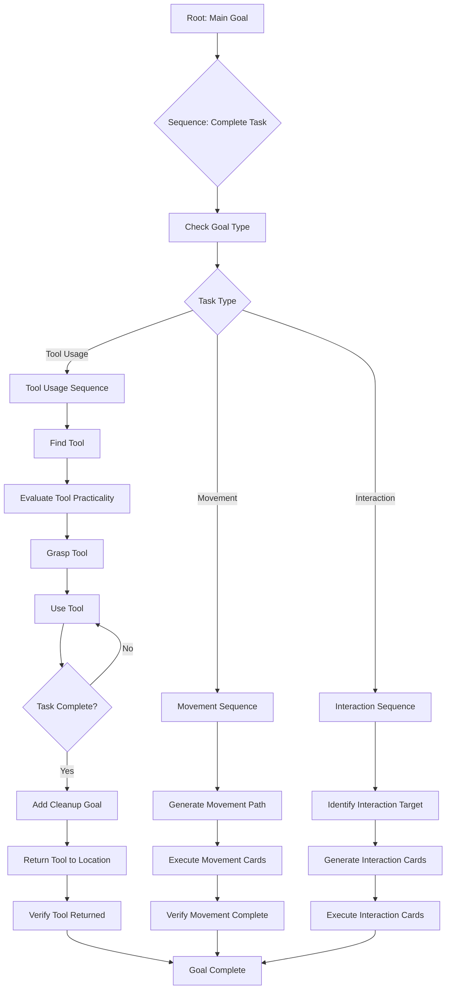
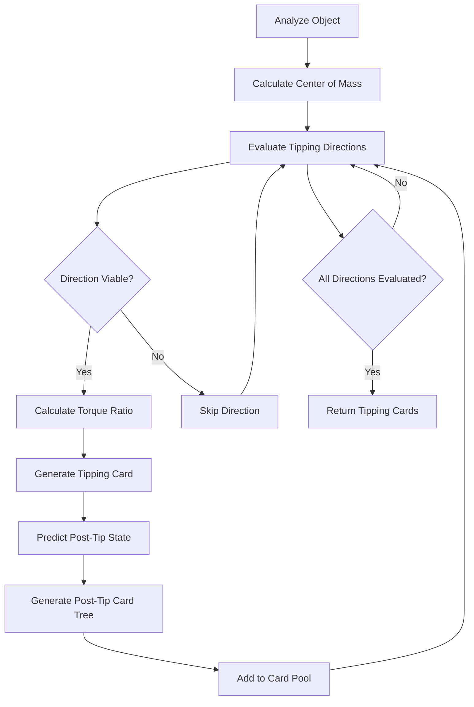
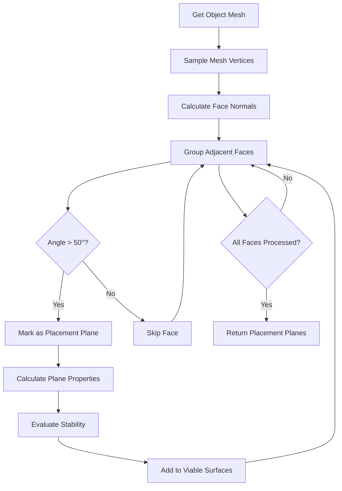
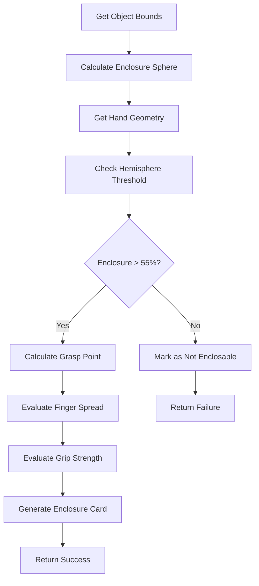
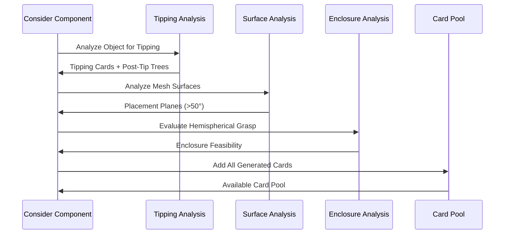
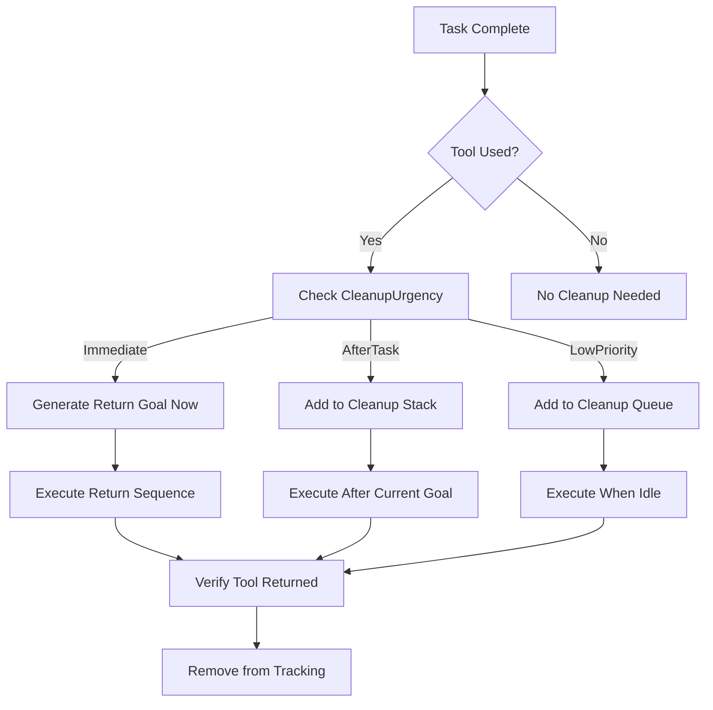
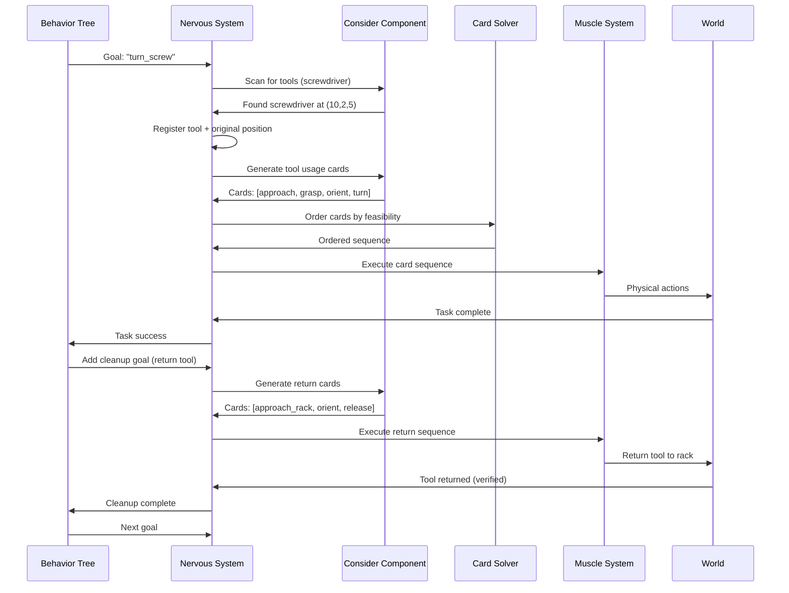

# Nervous System Architecture

## Overview

The Nervous System is the communication and control backbone for ragdoll physics animation. It routes impulses between body parts, manages tool usage, coordinates behavior tree goals, and handles object manipulation including cleanup (putting things back).

## System Architecture



## Impulse Flow Architecture



## Tool Usage Flow



## Behavior Tree Goal Structure



## Component Specifications

### NervousSystem Core

**File**: `Assets/locomotion/NervousSystem.cs`

**Responsibilities**:
- Route impulses bidirectionally (up/down)
- Maintain temporal graph of good sections
- Coordinate tool usage discovery
- Manage goal queues and cleanup tasks

**Key Properties**:
```csharp
public class NervousSystem : MonoBehaviour
{
    // Impulse routing
    private Dictionary<string, ImpulseChannel> impulseChannels;
    
    // Good section management
    private List<GoodSection> goodSections;
    private TemporalGraph temporalGraph;
    
    // Tool usage
    private List<Consider> considerComponents;
    private Dictionary<GameObject, ToolInfo> knownTools;
    
    // Goal management
    private Queue<BehaviorTreeGoal> goalQueue;
    private Stack<BehaviorTreeGoal> cleanupStack; // Goals to execute after main goal
    private BehaviorTreeGoal currentGoal;
    
    // Object tracking for cleanup
    private Dictionary<GameObject, Vector3> originalPositions; // Track where things came from
}
```

**Key Methods**:
- `SendImpulseDown(string channel, ImpulseData data)` - Motor commands
- `SendImpulseUp(string channel, ImpulseData data)` - Sensory feedback
- `GetAvailableGoodSections(GameObject target)` - Query cards
- `GetGoodSectionSequence(GameObject target, GoodSection goal)` - Path planning
- `RegisterTool(GameObject tool, Vector3 originalPosition)` - Track tools for cleanup
- `GenerateCleanupGoal(GameObject tool)` - Create return tool goal
- `ExecuteCleanupSequence()` - Process cleanup goals

### Tool Usage Flow

**1. Discovery Phase**:
```csharp
// Consider component scans for tools
List<ToolInfo> tools = Consider.ScanForTools(range: 10f, goal: currentGoal);
// ToolInfo includes: GameObject, usefulness, accessibility, grasp feasibility
```

**2. Evaluation Phase**:
```csharp
// Nervous system evaluates tool practicality
ToolPracticality eval = NervousSystem.EvaluateTool(tool, currentGoal, currentState);
// Returns: usefulness score, accessibility, required cards
```

**3. Planning Phase**:
```csharp
// Generate tool usage card sequence
List<GoodSection> toolCards = Consider.GenerateToolUsageCards(
    tool: screwdriver,
    task: "turn_screw",
    requiredCards: ["grasp", "orient", "apply", "release"]
);
```

**4. Cleanup Phase**:
```csharp
// After task completion, generate cleanup goal
BehaviorTreeGoal cleanupGoal = NervousSystem.GenerateCleanupGoal(
    tool: screwdriver,
    originalPosition: Vector3(5, 2, 3), // Where it came from
    urgency: CleanupUrgency.Low // Can do later
);

// Add to cleanup stack
NervousSystem.AddCleanupGoal(cleanupGoal);
```

### Consider Component (Enhanced)

**File**: `Assets/locomotion/Consider.cs`

**Key Properties**:
```csharp
public class Consider : MonoBehaviour
{
    [Header("Generation")]
    public GenerationMode mode = GenerationMode.OnStart;
    public float refreshInterval = 2f;
    
    [Header("Tool Awareness")]
    public bool scanForTools = true;
    public float toolScanRange = 10f;
    public bool generateToolUsageCards = true;
    public bool generateCleanupCards = true;
    
    [Header("Goal Awareness")]
    public bool considerCurrentGoals = true;
    public bool pruneInvalidCards = true;
    
    // Tool usage card generation
    private Dictionary<GameObject, List<GoodSection>> toolUsageCards;
    private Dictionary<GameObject, GoodSection> toolReturnCards;
}
```

**Tool Usage Methods**:
```csharp
// Scan for tools relevant to current goals
public List<ToolInfo> ScanForTools(float range, BehaviorTreeGoal goal);

// Evaluate tool practicality
public ToolPracticality EvaluateTool(GameObject tool, BehaviorTreeGoal goal, RagdollState state);

// Generate tool usage cards
public List<GoodSection> GenerateToolUsageCards(GameObject tool, string task, RagdollState state);

// Generate tool return cards
public GoodSection GenerateReturnCard(GameObject tool, Vector3 returnPosition, RagdollState state);

// Generate cleanup sequence
public List<GoodSection> GenerateCleanupSequence(List<GameObject> tools, Dictionary<GameObject, Vector3> originalPositions);
```

**Center of Mass Tipping Analysis**:
```csharp
// Analyze object center of mass and generate viable tipping cards
public List<TippingCard> GenerateTippingCards(GameObject obj, RagdollState state);

// Evaluate tipping viability in a direction
public TippingViability EvaluateTippingDirection(GameObject obj, Vector3 direction, RagdollState state);

// Generate post-tip card tree (predict what happens after tipping)
public CardTree GeneratePostTipCardTree(GameObject obj, Vector3 tipDirection, float tipAngle, RagdollState state);
```

**Mesh Surface Analysis**:
```csharp
// Analyze mesh surfaces for placement planes (>50 degree adjacent vectors)
public List<PlacementPlane> AnalyzePlacementSurfaces(GameObject obj);

// Find viable surfaces for object placement
public List<PlacementPlane> FindViablePlacementSurfaces(GameObject obj, float minAngle = 50f);

// Generate cards for placing objects on surfaces
public List<GoodSection> GeneratePlacementCards(GameObject obj, PlacementPlane surface, RagdollState state);
```

**Hemispherical Enclosure (Lego Hand Grasping)**:
```csharp
// Check if object can be enclosed with hemispherical grasp
public bool CanEncloseHemispherically(GameObject obj, Hand hand);

// Generate hemispherical grasp cards
public GoodSection GenerateHemisphericalGraspCard(GameObject obj, Hand hand, RagdollState state);

// Evaluate enclosure feasibility (slightly more than half hemisphere)
public EnclosureFeasibility EvaluateHemisphericalEnclosure(GameObject obj, Hand hand, float hemisphereThreshold = 0.55f);
```

**Key Properties (Enhanced)**:
```csharp
public class Consider : MonoBehaviour
{
    // ... existing properties ...
    
    [Header("Tipping Analysis")]
    public bool enableTippingAnalysis = true;
    public float tippingViabilityThreshold = 0.3f; // Minimum torque-to-weight ratio
    public int tippingDirectionsToEvaluate = 8; // Number of directions to check (8 = cardinal + diagonal)
    public float postTipPredictionDepth = 3; // How many cards deep to predict after tip
    
    [Header("Mesh Surface Analysis")]
    public bool enableSurfaceAnalysis = true;
    public float minPlacementAngle = 50f; // Minimum angle between adjacent vectors for viable surface
    public float surfaceSamplingDensity = 0.1f; // Mesh sampling resolution
    
    [Header("Hemispherical Enclosure")]
    public bool enableHemisphericalGrasp = true;
    public float hemisphereThreshold = 0.55f; // Slightly more than half (55%)
    public float enclosureTolerance = 0.05f; // Tolerance for enclosure fit
    
    // Tipping analysis
    private Dictionary<GameObject, TippingAnalysis> tippingAnalyses;
    
    // Surface analysis
    private Dictionary<GameObject, List<PlacementPlane>> placementSurfaces;
    
    // Enclosure analysis
    private Dictionary<GameObject, EnclosureFeasibility> enclosureFeasibilities;
}
```

### Advanced Procedural Card Generation

#### Center of Mass Tipping Analysis

The Consider component analyzes objects to determine viable tipping directions based on center of mass and generates predictive card trees for post-tip scenarios.

**TippingCard Structure**:
```csharp
public class TippingCard : GoodSection
{
    public GameObject targetObject;
    public Vector3 tipDirection; // Direction to apply force
    public Vector3 centerOfMass; // Object's center of mass
    public float tipAngle; // Angle to tip (in degrees)
    public float viabilityScore; // 0-1, how viable this tip is
    public float torqueRatio; // Applied torque / weight ratio
    public Vector3 contactPoint; // Point where force should be applied
    public bool requiresStabilization; // Will it fall after tipping?
    
    // Post-tip prediction tree
    public CardTree postTipTree; // What cards are possible after tipping
}

public struct TippingViability
{
    public Vector3 direction;
    public float viability; // 0-1
    public float torqueRatio;
    public Vector3 contactPoint;
    public bool isStable; // Will object stabilize in new position?
    public string reason; // Why yes/no
}
```

**Tipping Analysis Flow**:


**Implementation Example**:
```csharp
// Analyze object for viable tipping directions
public List<TippingCard> GenerateTippingCards(GameObject obj, RagdollState state)
{
    List<TippingCard> tippingCards = new List<TippingCard>();
    
    // Get object's center of mass (from Rigidbody or mesh analysis)
    Vector3 centerOfMass = GetCenterOfMass(obj);
    
    // Get object bounds for contact point estimation
    Bounds bounds = GetObjectBounds(obj);
    
    // Evaluate multiple directions (8 = cardinal + diagonal)
    int directions = 8;
    for (int i = 0; i < directions; i++)
    {
        float angle = (360f / directions) * i;
        Vector3 direction = new Vector3(
            Mathf.Cos(angle * Mathf.Deg2Rad),
            0f,
            Mathf.Sin(angle * Mathf.Deg2Rad)
        );
        
        // Evaluate viability
        TippingViability viability = EvaluateTippingDirection(obj, direction, state);
        
        if (viability.viability >= tippingViabilityThreshold)
        {
            // Generate tipping card
            TippingCard card = new TippingCard
            {
                targetObject = obj,
                tipDirection = direction,
                centerOfMass = centerOfMass,
                tipAngle = CalculateTipAngle(obj, direction),
                viabilityScore = viability.viability,
                torqueRatio = viability.torqueRatio,
                contactPoint = viability.contactPoint
            };
            
            // Predict post-tip card tree
            card.postTipTree = GeneratePostTipCardTree(obj, direction, card.tipAngle, state);
            
            tippingCards.Add(card);
        }
    }
    
    return tippingCards;
}

// Generate predictive card tree after tipping
public CardTree GeneratePostTipCardTree(GameObject obj, Vector3 tipDirection, float tipAngle, RagdollState state)
{
    CardTree tree = new CardTree();
    
    // Simulate object state after tipping
    RagdollState predictedState = PredictPostTipState(obj, tipDirection, tipAngle, state);
    
    // Generate cards available in predicted state
    // Depth 1: Immediate post-tip actions
    List<GoodSection> immediateCards = GenerateCardsForState(obj, predictedState);
    
    // Depth 2-3: Further actions after post-tip cards
    foreach (GoodSection card in immediateCards)
    {
        RagdollState stateAfterCard = PredictStateAfterCard(obj, card, predictedState);
        List<GoodSection> followUpCards = GenerateCardsForState(obj, stateAfterCard);
        
        tree.AddBranch(card, followUpCards);
    }
    
    return tree;
}
```

#### Mesh Surface Analysis for Placement

The Consider component analyzes mesh surfaces to find viable placement planes where objects can be placed or grasped.

**PlacementPlane Structure**:
```csharp
public struct PlacementPlane
{
    public Vector3 center; // Center point of plane
    public Vector3 normal; // Normal vector (pointing up)
    public float area; // Surface area
    public float angle; // Angle of plane (from horizontal)
    public List<Vector3> vertices; // Vertices forming the plane
    public bool isStable; // Can objects rest here?
    public float stabilityScore; // 0-1, how stable
    
    // For grasping
    public bool canGraspFromAbove; // Can hand grasp from above?
    public bool canGraspFromSide; // Can hand grasp from side?
}

public struct SurfaceAnalysisResult
{
    public GameObject object;
    public List<PlacementPlane> viableSurfaces; // Surfaces with >50° adjacent vectors
    public List<PlacementPlane> graspableSurfaces; // Surfaces suitable for grasping
    public Dictionary<PlacementPlane, float> stabilityScores; // Stability for each surface
}
```

**Surface Analysis Flow**:


**Implementation Example**:
```csharp
// Analyze mesh for placement surfaces (>50° adjacent vectors)
public List<PlacementPlane> AnalyzePlacementSurfaces(GameObject obj)
{
    List<PlacementPlane> placementPlanes = new List<PlacementPlane>();
    
    // Get mesh
    Mesh mesh = GetMesh(obj);
    if (mesh == null)
        return placementPlanes;
    
    // Get mesh transform
    Transform objTransform = obj.transform;
    
    // Sample mesh at specified density
    List<Vector3> vertices = new List<Vector3>();
    List<Vector3> normals = new List<Vector3>();
    GetSampledVertices(mesh, objTransform, surfaceSamplingDensity, out vertices, out normals);
    
    // Group vertices by similar normals (>50° = viable surface)
    Dictionary<Vector3, List<Vector3>> groupedByNormal = new Dictionary<Vector3, List<Vector3>>();
    
    foreach (Vector3 vertex in vertices)
    {
        Vector3 normal = GetNormalAtVertex(mesh, objTransform, vertex);
        
        // Find similar normal (within angle tolerance)
        bool foundGroup = false;
        foreach (Vector3 existingNormal in groupedByNormal.Keys)
        {
            float angle = Vector3.Angle(normal, existingNormal);
            if (angle < minPlacementAngle) // If >50° from adjacent, it's a distinct plane
            {
                groupedByNormal[existingNormal].Add(vertex);
                foundGroup = true;
                break;
            }
        }
        
        if (!foundGroup)
        {
            groupedByNormal[normal] = new List<Vector3> { vertex };
        }
    }
    
    // Create placement planes from groups
    foreach (KeyValuePair<Vector3, List<Vector3>> group in groupedByNormal)
    {
        if (group.Value.Count >= 3) // Need at least 3 points for a plane
        {
            PlacementPlane plane = new PlacementPlane
            {
                normal = group.Key,
                vertices = group.Value,
                center = CalculateCentroid(group.Value),
                area = CalculatePlaneArea(group.Value),
                angle = Vector3.Angle(group.Key, Vector3.up) // Angle from horizontal
            };
            
            // Evaluate stability (more horizontal = more stable)
            plane.stabilityScore = 1f - (plane.angle / 90f); // 0-1 scale
            plane.isStable = plane.angle < 45f; // Stable if <45° from horizontal
            
            placementPlanes.Add(plane);
        }
    }
    
    return placementPlanes;
}
```

#### Hemispherical Enclosure (Lego Hand Grasping)

The Consider component evaluates whether objects can be enclosed with a hemispherical grasp pattern, similar to how a Lego hand encloses a brick.

**EnclosureFeasibility Structure**:
```csharp
public struct EnclosureFeasibility
{
    public bool canEnclose; // Can hand enclose object?
    public float enclosureRatio; // 0-1, how well it encloses (0.55+ = good)
    public Vector3 optimalGraspPoint; // Best point to center grasp
    public Vector3 optimalGraspDirection; // Direction hand should approach
    public float requiredFingerSpread; // How far fingers need to spread
    public float gripStrengthRequired; // Minimum grip strength needed
    public string feasibilityReason; // Why yes/no
}

public class HemisphericalGraspCard : GoodSection
{
    public GameObject targetObject;
    public Hand hand; // Which hand to use
    public Vector3 graspPoint; // Center of enclosure
    public Vector3 approachDirection; // Direction to approach from
    public float fingerSpread; // Required finger spread angle
    public float gripStrength; // Required grip strength
    public float enclosureRatio; // How well it encloses (0.55+ = good)
}
```

**Enclosure Analysis Flow**:


**Implementation Example**:
```csharp
// Evaluate hemispherical enclosure feasibility
public EnclosureFeasibility EvaluateHemisphericalEnclosure(GameObject obj, Hand hand, float hemisphereThreshold = 0.55f)
{
    EnclosureFeasibility feasibility = new EnclosureFeasibility();
    
    // Get object bounds
    Bounds objBounds = GetObjectBounds(obj);
    
    // Calculate minimum enclosing sphere
    float sphereRadius = Mathf.Max(
        objBounds.size.x,
        objBounds.size.y,
        objBounds.size.z
    ) / 2f;
    
    // Get hand geometry (hemisphere radius)
    float handHemisphereRadius = GetHandHemisphereRadius(hand);
    
    // Check if hand can enclose object (slightly more than half sphere = 55%+)
    float requiredEnclosure = sphereRadius / handHemisphereRadius;
    
    if (requiredEnclosure <= hemisphereThreshold)
    {
        feasibility.canEnclose = false;
        feasibility.feasibilityReason = $"Object too large (requires {requiredEnclosure:P}, threshold {hemisphereThreshold:P})";
        return feasibility;
    }
    
    // Calculate optimal grasp point (center of object)
    feasibility.optimalGraspPoint = objBounds.center;
    
    // Calculate optimal approach direction (from above, toward center)
    feasibility.optimalGraspDirection = -Vector3.up;
    
    // Calculate required finger spread
    float angleToEdge = Mathf.Atan2(objBounds.extents.y, handHemisphereRadius) * Mathf.Rad2Deg;
    feasibility.requiredFingerSpread = angleToEdge * 2f; // Total spread angle
    
    // Check if finger spread is feasible
    if (feasibility.requiredFingerSpread > hand.maxFingerSpread)
    {
        feasibility.canEnclose = false;
        feasibility.feasibilityReason = $"Finger spread too large ({feasibility.requiredFingerSpread:F1}° > {hand.maxFingerSpread:F1}°)";
        return feasibility;
    }
    
    // Calculate required grip strength (based on object weight)
    float objectMass = GetObjectMass(obj);
    feasibility.gripStrengthRequired = objectMass * 9.81f; // Weight in Newtons
    
    // Check if grip strength is sufficient
    if (feasibility.gripStrengthRequired > hand.maxGripStrength)
    {
        feasibility.canEnclose = false;
        feasibility.feasibilityReason = $"Object too heavy ({feasibility.gripStrengthRequired:F1}N > {hand.maxGripStrength:F1}N)";
        return feasibility;
    }
    
    // Calculate enclosure ratio (how well it encloses)
    feasibility.enclosureRatio = 1f - requiredEnclosure; // Inverse: smaller required = better enclosure
    feasibility.canEnclose = true;
    feasibility.feasibilityReason = "Object can be enclosed hemispherically";
    
    return feasibility;
}

// Generate hemispherical grasp card
public GoodSection GenerateHemisphericalGraspCard(GameObject obj, Hand hand, RagdollState state)
{
    EnclosureFeasibility feasibility = EvaluateHemisphericalEnclosure(obj, hand, hemisphereThreshold);
    
    if (!feasibility.canEnclose)
        return null; // Cannot generate card
    
    HemisphericalGraspCard card = new HemisphericalGraspCard
    {
        targetObject = obj,
        hand = hand,
        graspPoint = feasibility.optimalGraspPoint,
        approachDirection = feasibility.optimalGraspDirection,
        fingerSpread = feasibility.requiredFingerSpread,
        gripStrength = feasibility.gripStrengthRequired,
        enclosureRatio = feasibility.enclosureRatio
    };
    
    return card;
}
```

### Integration Flow: Tipping + Surface Analysis + Enclosure



### Goal Management

**Behavior Tree Goals**:
```csharp
public class BehaviorTreeGoal
{
    public string goalName; // "turn_screw", "pick_up_object", etc.
    public GoalType type; // ToolUsage, Movement, Interaction, Cleanup
    public GameObject target; // Target object/location
    public Vector3 targetPosition; // Target position
    public Dictionary<string, object> parameters; // Goal-specific parameters
    
    // Cleanup tracking
    public bool requiresCleanup; // Should we put things back?
    public List<GameObject> toolsUsed; // Tools that need returning
    public Dictionary<GameObject, Vector3> originalPositions; // Where tools came from
    
    // Priority and timing
    public int priority;
    public CleanupUrgency cleanupUrgency; // Immediate, AfterTask, LowPriority
}

public enum GoalType
{
    ToolUsage,
    Movement,
    Interaction,
    Cleanup,
    Composite // Multiple sub-goals
}

public enum CleanupUrgency
{
    Immediate, // Return immediately after use
    AfterTask, // Return after current task complete
    LowPriority // Return when convenient
}
```

### Tool Practicality Evaluation

**ToolPracticality Structure**:
```csharp
public struct ToolPracticality
{
    public GameObject tool;
    public string toolName;
    
    // Scoring (0-1)
    public float usefulness; // How useful for current goal
    public float accessibility; // Can we reach/grasp it
    public float efficiency; // Better than alternatives?
    public float graspDifficulty; // How hard to hold
    public float overallScore; // Combined score
    
    // Generated cards
    public GoodSection approachCard; // Move toward tool
    public GoodSection graspCard; // Pick up tool
    public GoodSection orientCard; // Rotate to usage angle
    public GoodSection useCard; // Apply tool to task
    public GoodSection releaseCard; // Let go of tool
    public GoodSection returnCard; // Return tool to original position
    
    // Feasibility
    public bool isFeasible; // Can we actually do this?
    public string feasibilityReason; // Why yes/no
}
```

## Cleanup System ("Putting Things Back")

### Cleanup Goal Generation

When a tool usage task completes:



### Cleanup Sequence Example

**Tool: Screwdriver**
1. Original position: Tool rack at (10, 2, 5)
2. Task: Turn screw at (5, 1, 3)
3. After task:
   - **Cleanup Goal Created**: Return screwdriver to (10, 2, 5)
   - **Return Cards Generated**: 
     - "approach_tool_rack"
     - "orient_tool_to_rack"
     - "release_tool_into_rack"
   - **Verification**: Tool within 0.1m of original position

### Cleanup Implementation

```csharp
// Nervous system tracks original positions
public void RegisterTool(GameObject tool, Vector3 originalPosition)
{
    originalPositions[tool] = originalPosition;
    knownTools[tool] = new ToolInfo { gameObject = tool, originalPosition = originalPosition };
}

// Generate cleanup goal after tool usage
public BehaviorTreeGoal GenerateCleanupGoal(GameObject tool, CleanupUrgency urgency)
{
    if (!originalPositions.ContainsKey(tool))
        return null; // Tool wasn't tracked
    
    Vector3 returnPos = originalPositions[tool];
    
    return new BehaviorTreeGoal
    {
        goalName = $"return_{tool.name}",
        type = GoalType.Cleanup,
        target = tool,
        targetPosition = returnPos,
        requiresCleanup = false, // This IS the cleanup
        priority = (urgency == CleanupUrgency.Immediate) ? 10 : 5,
        cleanupUrgency = urgency
    };
}

// Process cleanup stack
public void ProcessCleanupGoals()
{
    while (cleanupStack.Count > 0)
    {
        BehaviorTreeGoal cleanupGoal = cleanupStack.Pop();
        
        // Generate return cards
        GoodSection returnCard = Consider.GenerateReturnCard(
            cleanupGoal.target,
            cleanupGoal.targetPosition,
            GetCurrentState()
        );
        
        // Execute return sequence
        ExecuteCardSequence(new List<GoodSection> { returnCard });
        
        // Verify tool returned
        float distance = Vector3.Distance(
            cleanupGoal.target.transform.position,
            cleanupGoal.targetPosition
        );
        
        if (distance < 0.1f) // Within tolerance
        {
            originalPositions.Remove(cleanupGoal.target);
            Debug.Log($"Tool {cleanupGoal.target.name} returned successfully");
        }
    }
}
```

## Integration with Behavior Trees

### Tool Usage Behavior Tree Node

```csharp
public class UseToolNode : BehaviorTreeNode
{
    public GameObject tool;
    public string task;
    public bool cleanupAfterUse = true;
    public CleanupUrgency cleanupUrgency = CleanupUrgency.AfterTask;
    
    public override BehaviorTreeStatus Execute()
    {
        // 1. Check if tool is available
        if (!ToolAvailable(tool))
            return BehaviorTreeStatus.Failure;
        
        // 2. Get tool usage cards from Consider
        List<GoodSection> cards = Consider.GenerateToolUsageCards(tool, task);
        
        // 3. Execute tool usage sequence
        bool success = ExecuteCardSequence(cards);
        
        // 4. If cleanup enabled, add cleanup goal
        if (success && cleanupAfterUse)
        {
            NervousSystem.AddCleanupGoal(
                NervousSystem.GenerateCleanupGoal(tool, cleanupUrgency)
            );
        }
        
        return success ? BehaviorTreeStatus.Success : BehaviorTreeStatus.Failure;
    }
}
```

### Cleanup Behavior Tree Node

```csharp
public class CleanupNode : BehaviorTreeNode
{
    public override BehaviorTreeStatus Execute()
    {
        // Process all pending cleanup goals
        NervousSystem.ProcessCleanupGoals();
        
        // Check if cleanup is complete
        bool cleanupComplete = NervousSystem.cleanupStack.Count == 0;
        
        return cleanupComplete ? BehaviorTreeStatus.Success : BehaviorTreeStatus.Running;
    }
}
```

## Complete Flow Example: Screwdriver Task with Cleanup



## Key Features

### 1. Bidirectional Impulse Flow
- **Up**: Sensory data (contacts, events, tool detection)
- **Down**: Motor commands (muscle activations, card execution)

### 2. Tool Usage Integration
- Automatic tool discovery via Consider component
- Practicality evaluation and grasp feasibility
- Dynamic card generation for tool interactions
- Cleanup goal generation after tool use

### 3. Goal Management
- Goal queue for sequential task execution
- Cleanup stack for post-task cleanup
- Goal priority and urgency handling
- Original position tracking for cleanup

### 4. Temporal Graph
- Good sections connected by state transitions
- Angular topology for efficient pathfinding
- Card sequences for complex actions
- LSTM prediction for next card selection

### 5. Behavior Tree Integration
- Strategic decision making (which tool, when)
- Tactical execution via physics cards
- Goal pruning based on available cards
- Cleanup automation

## Implementation Notes

- **Tool Tracking**: Original positions stored in NervousSystem for cleanup
- **Cleanup Urgency**: Three levels (Immediate, AfterTask, LowPriority) for flexible scheduling
- **Goal Pruning**: Behavior trees prune invalid branches when tools unavailable
- **Card Generation**: Consider component generates cards on-demand for tool usage
- **Verification**: System verifies tool returned within tolerance before marking cleanup complete
- **Multi-Tool Scenarios**: System can track multiple tools and return them in sequence

This architecture provides a complete nervous system that handles tool discovery, usage, and cleanup automatically, making the ragdoll AI aware of its environment and responsible for maintaining order.
