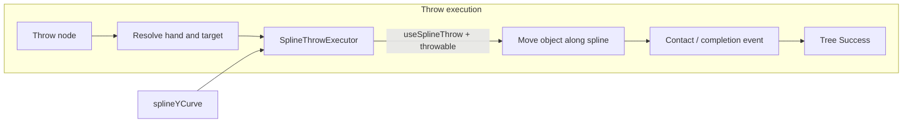

# Throw-only good sections and IK throw goal mode

Plan: throw-only good sections (arbitrary throw-target goals, no traversability), IK trainer throw goal mode, and spline throw for spoofing throws with physics-like completion events.

---

## 1. Throw-only good sections (no traversability)

**Goal:** Good sections that represent "throw at target" goals only: tool use (e.g. batterang) with no pathfinding beyond using the goal for throw calculation. They use the same goal systems (BehaviorTreeGoal) but are never used for traversability bridging.

**Data model**

- **[GoodSection.cs](Assets/locomotion/GoodSection.cs):**
  - Add **`isThrowGoalOnly`** (bool). When true: this section is a throw-at-target card only; do not use for traversability (ToolTraversabilityPlanner must ignore it); use when the current goal is a throw goal (GoalType.Throw) and target/targetPosition is the throw target.
  - Convention: throw-only cards have `needsToBeThrown` true and `enablesTraversability` false (or `isThrowGoalOnly` true). Traversability "throw" (bridge) keeps `enablesTraversability` true and `traversabilityMode == Throw`.
  - Optional helper: **`IsThrowGoalOnly()`** that returns `isThrowGoalOnly || (needsToBeThrown && !enablesTraversability)`.

**Planner / solver**

- **ToolTraversabilityPlanner:** Skip sections where `section.isThrowGoalOnly` or `IsThrowGoalOnly()` is true when building bridge segments.
- **PhysicsCardSolver.FindCardMatchingGoal:** When `goal.type == GoalType.Throw`, prefer throw-only cards; use `goal.targetPosition` as throw target.

**Goals**

- **BehaviorTreeGoal.cs:** Add **`GoalType.Throw`** to the GoalType enum. Semantics: goal.target or goal.targetPosition is the throw target; no pathfinding segment after the throw.

---

## 2. IK trainer: throw goal mode

**Goal:** When the IK trainer runs in Throw category, use an explicit throw goal (spatial target) from the run asset. No pathfinding; the goal is used only for throw calculation.

**Data model**

- **PhysicsIKTrainingRunAsset:** Add **`throwTargetPosition`** (Vector3) and **`throwGoalTarget`** (GameObject, optional). When category is Throw, spatial goal = throw target.
- **PhysicsIKTrainingRunner.RunOne:** When category is Throw, resolve spatial goal from runAsset (throwGoalTarget?.position ?? throwTargetPosition).
- **PhysicsIKTrainingWindow:** When category is Throw, add UI for Throw target position and Throw goal target (GameObject).

---

## 3. Spline throw (useSplineThrow, splineYCurve, runtime hand-to-target)

**Goal:** When **`useSplineThrow`** is enabled and the throw object is **throwable**, spoof the throw with a **spline** from hand to target. The spline is calculated at **runtime** when the solver executes the throw node. A **`splineYCurve`** (editable AnimationCurve) defines the vertical profile (e.g. arc). The system provides the **same physics contact acknowledgement events and completions** for the tree system as a real physics throw would (so the behavior tree gets "throw completed / hit target" without requiring full rigidbody simulation).

### 3.1 Data model

- **GoodSection** (or a small **SplineThrowConfig** used by the throw executor):
  - **`useSplineThrow`** (bool): when true, throw is spoofed via spline from hand to target instead of (or in addition to) physics.
  - **`splineYCurve`** (AnimationCurve): vertical profile for the spoofed arc; normalized (e.g. 0 = hand height, 1 = target; or 0..1 along horizontal progress with Y as relative height). Edited in inspector to tune arc shape (parabolic, flat, etc.).
- **Throwable object:** The thrown object (e.g. from `thrownObject` / `throwGoalTarget`) must be marked or detected as **throwable** (e.g. a component like `Throwable` or tag, or a Rigidbody that the spline driver will move). The spline executor only runs when the object is throwable.

### 3.2 Runtime behavior

- **When the solver executes the throw node** (e.g. ExecuteToolTraversabilityNode with a throw card, or a dedicated ThrowAtGoalNode):
  1. Resolve **hand position** (from ragdoll/hand bone or card metadata) and **target position** (from goal.targetPosition or goal.target).
  2. If **useSplineThrow** is true and the throw object is **throwable**:
     - **Calculate spline at runtime:** Build a 3D curve from hand to target. Use **splineYCurve** to define the Y (height) component along the arc—e.g. horizontal progress 0..1 maps to curve time; Y = base Y + splineYCurve.Evaluate(t) * amplitude or similar so the arc can be edited.
     - **Animate the throwable object** along the spline (position each frame; optionally rotation for spin). No rigidbody velocity simulation; movement is scripted.
     - **Contact / completion:** When the object reaches the target (or passes within a threshold), fire the **same physics contact acknowledgement events** that the tree system expects (e.g. "throw hit target", "throw completed"). Options:
         - **Collision/trigger at target:** Place a small trigger at target; when the spline-driven object enters it, emit contact/completion.
         - **Synthetic event:** When spline progress >= 1 (or distance to target < epsilon), invoke a completion callback or push an impulse/event that the behavior tree uses to transition the node to Success (same as if a real throw had hit).
  3. **Tree system:** The node that executed the throw returns **Running** until the spline throw completes (object reaches target or timeout); then it reports **Success** (or Failure on timeout). Downstream logic sees the same completion semantics as a physics-driven throw.

### 3.3 Files and responsibilities

- **GoodSection** (or SplineThrowConfig): `useSplineThrow`, `splineYCurve` (and optionally spline duration, speed, or sample count).
- **Spline throw executor:** New component or static helper (e.g. **SplineThrowExecutor** or method on a throw node): given hand position, target position, splineYCurve, and throwable object, computes the spline path, moves the object along it each frame, and signals completion (and optionally raises contact events) when done. Can live next to ExecuteToolTraversabilityNode or in a dedicated throw execution module.
- **Throwable:** Optional component on the thrown object: marks it as throwable and optionally holds reference to the spline driver or event sink for "hit target" so the tree gets the same completion/contact events.
- **Behavior tree node** (throw node): When executing a throw card with useSplineThrow, start the spline throw; return Running until SplineThrowExecutor signals completion; then return Success. Ensure any existing physics contact listeners or completion handlers are also invoked (or unified) so the tree system does not need to distinguish spline vs physics throw for success/failure.

### 3.4 Diagram

---

## 4. Summary table

| Area | File / component | Changes |
|------|------------------|--------|
| Throw-only | GoodSection.cs | `isThrowGoalOnly`, optional `IsThrowGoalOnly()`. |
| Goals | BehaviorTreeGoal.cs | `GoalType.Throw`. |
| Planner | ToolTraversabilityPlanner.cs | Skip `isThrowGoalOnly` sections. |
| Solver | PhysicsCardSolver.cs | FindCardMatchingGoal for GoalType.Throw, prefer throw-only cards. |
| IK run asset | PhysicsIKTrainingRunAsset.cs | `throwTargetPosition`, `throwGoalTarget`. |
| IK runner | PhysicsIKTrainingRunner.cs | Resolve throw target when category Throw. |
| IK window | PhysicsIKTrainingWindow.cs | Throw target position and goal target UI. |
| Spline throw | GoodSection or SplineThrowConfig | `useSplineThrow`, `splineYCurve`. |
| Spline throw | SplineThrowExecutor (new) | Runtime spline hand→target, move throwable, completion/contact events. |
| Spline throw | Throw node / ExecuteToolTraversabilityNode | When useSplineThrow + throwable, run SplineThrowExecutor; return Success on completion (same as physics). |
| Optional | Throwable component | Mark object throwable; hook completion for tree. |
