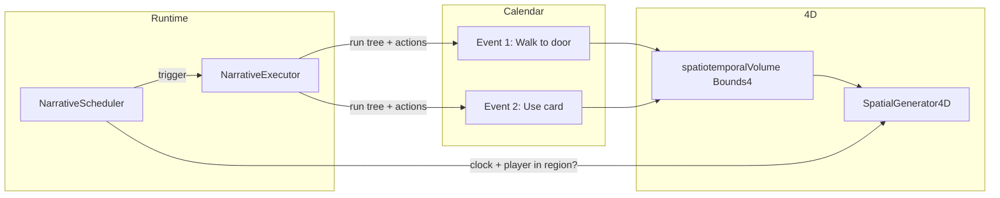

# SpatialGenerator4D Setup Guide

This guide explains how to use **SpatialGenerator4D** for narrative events that only fire when the player is in a specific region at a specific narrative time. It walks through a concrete example ("walk over here, use this card to open the door") and clarifies the 4D "tree," sequences, and actions.

---

## What is 4D for?

**SpatialGenerator4D** stores **(x, y, z, t)** volumes: a 3D region in space plus a time window in narrative seconds. When you attach a **spatiotemporalVolume** (Bounds4) to a calendar event:

- The event **only triggers** when:
  1. Narrative time is inside the event’s time window **[tMin, tMax]**, and  
  2. The player (or bound object) is **inside** the event’s 3D region.

So 4D = **place events in space and time**. Use it for "walk over here, then use the card at the door" style flows.

---

## Glossary

| Term | Meaning |
|------|--------|
| **spatiotemporalVolume** | Optional Bounds4 on a calendar event: (center, size) in world space + (tMin, tMax) in **narrative seconds** (since 2025-01-01 00:00 UTC). When set, the event only fires when the player is inside the region and narrative time is in [tMin, tMax]. |
| **tree** | Optional **NarrativeTreeAsset** on an event: a behavior/narrative tree that runs when the event fires (e.g. "GoTo" goal, "Use object"). |
| **actions** | Optional list of **NarrativeActionSpec** on an event: direct effects (SpawnPrefab, CallMethod, TriggerSpatialGenerate, etc.). When the event runs, these execute; if both tree and actions are set, the tree runs first, then the actions. |
| **sequence** | The **order of events** on the calendar: by start time and by **causal links** (fromEventId → toEventId). "Sequence" = which events run in what order. |
| **causal link** | A link from one event (fromEventId) to another (toEventId). The target event only becomes eligible after the source event has been triggered. Use this for "do A, then B." |

**4D "tree"** is not a single tree. It’s the combination of:

1. Calendar events  
2. Each event’s optional **spatiotemporalVolume** (where/when the event is placed in 4D)  
3. Each event’s optional **tree** (behavior tree to run)  
4. Each event’s optional **actions** (direct effects)  
5. **Causal links** between events (A enables B)

---

## Example: "Walk over here, use this card to open the door"

### 1. Scene setup

You need:

- **NarrativeCalendarAsset** – holds the list of events.
- **NarrativeScheduler** – watches the calendar and clock; triggers events when conditions are met (calendar time + optional 4D region check). Assign: calendar, clock, executor; set **positionKeys** (list, default includes `"player"`) so the scheduler can resolve positions for the region check. An event can override with its own **positionKeys** on the event.
- **Narrative4DPlacer** – inserts each event’s **spatiotemporalVolume** into SpatialGenerator4D so the 4D query API knows where events are. Assign: calendar, SpatialGenerator4D (or leave null to resolve from an **SpatialGenerator4DOrchestrator** in the hierarchy).
- **SpatialGenerator4D** – holds (x,y,z,t) volumes. Set **spatialBounds**, **tMin**, **tMax** to cover your narrative time range (tMin/tMax in narrative seconds, same epoch as NarrativeCalendarMath: 2025-01-01 00:00 UTC).
- **NarrativeClock** + **NarrativeExecutor** – clock drives narrative time; executor runs the event’s tree and/or actions.
- **Player** (or listener) – a GameObject bound in **NarrativeBindings** under the key used by the scheduler (e.g. `"player"`).

### 2. Event 1 – "Walk to door"

- **startDateTime** / **durationSeconds**: e.g. Day 1, 09:00, 60 s (nominal window).
- **spatiotemporalVolume**: Set to a Bounds4:
  - **center** = world position near the door (e.g. trigger zone center).
  - **size** = trigger zone size (e.g. 2, 2, 2).
  - **tMin** / **tMax** = narrative seconds for that window. Use `NarrativeCalendarMath.DateTimeToSeconds(NarrativeDateTime)` for the start and end of the window (e.g. 09:00 day 1 → 09:01 day 1).
- **tree**: Assign a NarrativeTreeAsset with a goal like "GoTo" and target position near the door (or use actions that move the player).
- **Causal link**: None (first event).

### 3. Event 2 – "Use card to open door"

- **startDateTime**: After Event 1 (e.g. same day, 09:05).
- **durationSeconds**: As needed (e.g. 30).
- **spatiotemporalVolume**: Same (or similar) region near the door; **tMin**/ **tMax** after Event 1’s window so the player has time to "walk" first.
- **actions**: Add an action (e.g. CallMethod or a custom "UseCard" / "OpenDoor" action) that runs when this event fires.
- **Causal link**: In the calendar’s **4D Causal Links**, add a link: **fromEventId** = Event 1’s `id`, **toEventId** = Event 2’s `id`. Then "Use card" only becomes eligible after "Walk to door" has been triggered.

### 4. 4D tree setup – order of operations

1. Create the **NarrativeCalendarAsset** and add **events** (Event 1, Event 2, etc.).  
2. For each event that should be location- and time-gated, set **spatiotemporalVolume** (center/size in world, tMin/tMax in narrative seconds; align with NarrativeCalendarMath epoch 2025-01-01).  
3. Ensure **Narrative4DPlacer** (or manual Insert into SpatialGenerator4D) runs so event volumes are inserted into SpatialGenerator4D.  
4. Set **tree** and/or **actions** per event.  
5. Add **causal links** where one event must complete before another (fromEventId → toEventId).
  5a. Ensure receiving card is a part of causal link.

---

## Flow diagram

Calendar events with **spatiotemporalVolume** are placed in **SpatialGenerator4D**. The **NarrativeScheduler** checks narrative time and player position against the 4D volumes; when both match, it triggers the event and the **NarrativeExecutor** runs that event’s tree and/or actions.

---

## Quick reference

- **tMin / tMax**: Narrative seconds since 2025-01-01 00:00 UTC. Use `NarrativeCalendarMath.DateTimeToSeconds(dt)` to convert a NarrativeDateTime to seconds, and `NarrativeCalendarMath.SecondsToNarrativeDateTime(t)` to convert back.  
- **Player position**: Set NarrativeScheduler’s **positionKeys** (list; default includes `"player"`) and ensure each key is bound in the executor’s NarrativeBindings. An event triggers when any of those keys resolves to a GameObject inside the event’s spatiotemporal volume. Events can override with **positionKeys** on the event.  
- **Causal links**: Stored on the NarrativeCalendarAsset under "4D Causal Links"; fromEventId enables toEventId.
