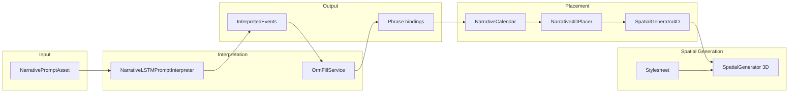

# Prompt / Generator Process Flow

This document explains how natural-language prompts flow through the system to become 4D-placed events, spatial generators, and runtime behavior. It covers the LSTM interpreter, ORM resolution, calendar/4D placement, and the **Prompt Tree Inspector** for inspection and asset completeness.

---

## Overview

---

## Step-by-Step Flow

### 1. Prompt asset

- **NarrativePromptAsset** stores `originalText` (authored) and `proceduralText` (generated by LLM preprocessing, if any).
- The interpreter uses the "active" text: procedural if non-empty, else original.
- Optional: preprocess via `IPromptPreprocessor` to expand vocabulary or normalize before interpretation.

### 2. LSTM interpretation

- **NarrativeLSTMPromptInterpreter** runs the prompt through an ONNX model (Barracuda).
- Output: **InterpretedEvent** list — each event has:
  - `title` (phrase, e.g. "ball", "red ball")
  - `startSeconds`, `durationSeconds`
  - `center`, `size`, `tMin`, `tMax` (4D bounds)
- See [README_NarrativeLSTM.md](../../Scripts/README_NarrativeLSTM.md) for training and vocab setup.

### 3. ORM resolution (bindings)

- **OrmFillService** resolves each event’s `title` (phrase) against **SceneObjectRegistry**.
- **SceneObjectRegistry** maps keys and synonyms → `SceneObjectEntry` (reference, prefabForClone, synonyms).
- Result: **InterpretedEventBinding** per event:
  - `phrase` — original phrase
  - `status` — `OrmMatched`, `UnderstoodNoOrmMatch`, or `MarkedGenerate`
  - `resolvedOrmKey` — canonical key when matched

### 4. Calendar and 4D placement

- **ApplyToCalendar** adds interpreted events to **NarrativeCalendarAsset**.
- Each event gets a `spatiotemporalVolume` (Bounds4) and optional `positionKeys` from bindings.
- **Narrative4DPlacer** inserts these volumes into **SpatialGenerator4D** so the 4D query API knows where events are in (x,y,z,t).

### 5. Spatial generation (3D layout)

- **SpatialGenerator** (3D) uses a behavior tree (**SGBehaviorTreeNode**) and **SpatialGeneratorStylesheet**.
- Stylesheet maps `nodeKey` (or `SGBehaviorTreeNode.skinKey` / `node.name`) → prefab overrides.
- ORM keys (e.g. "ball") must be bridged to stylesheet `nodeKey` or node names for prefab placement.

---

## Prompt Tree Inspector

The **Prompt Tree Inspector** (Window → Locomotion → Narrative → Prompt Tree Inspector) is attached to a **SpatialGenerator4D** and lets you:

1. **Paragraph view** — Prompt text with each phrase grouped in a dashed box. Click a phrase to jump to its row.
2. **Vertical list** — All words/phrases with synonyms, status, resolved key.
3. **Per-item inspect** — ORM lookup, prefab/synonym completeness, and two progression wizards:
   - **Rounded prefab** — Steps: ORM registered → has prefab → has mesh → has materials → has animations.
   - **Fill selection** — Steps: phrase resolved to ORM key → ORM has prefab → stylesheet maps key → ready for placement.

**Access points:**

- SpatialGenerator4D inspector: "Open Prompt Tree Inspector"
- SpatialGenerator4DOrchestrator inspector: "Open Prompt Tree Inspector" (next to Refresh 4D mirror)
- Interpretation Examiner: "Open in Prompt Tree Inspector" (toolbar)

---

## Key files

| Role | File |
|------|------|
| Prompt asset | [NarrativePromptAsset.cs](../locomotion/narrative/Runtime/NarrativePromptAsset.cs) |
| LSTM interpreter | [NarrativeLSTMPromptInterpreter.cs](../locomotion/narrative/Inference/NarrativeLSTMPromptInterpreter.cs) |
| ORM fill | [OrmFillService.cs](../locomotion/narrative/Inference/OrmFillService.cs) |
| Scene registry | [SceneObjectORM.cs](../locomotion/SceneObjectORM.cs) |
| 4D placer | [Narrative4DPlacer.cs](../BedogaGenerator/Narrative4DPlacer.cs) |
| 4D generator | [SpatialGenerator4D.cs](../BedogaGenerator/SpatialGenerator4D.cs) |
| Stylesheet | [SpatialGeneratorStylesheet.cs](../BedogaGenerator/SpatialGeneratorStylesheet.cs) |
| Prompt Tree Inspector | [PromptTreeInspectorWindow.cs](../locomotion/narrative/Editor/PromptTreeInspectorWindow.cs) |

---

## Related docs

- [SpatialGenerator4D_Setup.md](../BedogaGenerator/SpatialGenerator4D_Setup.md) — 4D volumes, calendar, causal links.
- [TimeTravelingBearBuildSteps.md](TimeTravelingBearBuildSteps.md) — Full build guide including LSTM and 4D.
- [README_NarrativeLSTM.md](../../Scripts/README_NarrativeLSTM.md) — LSTM training and export.
