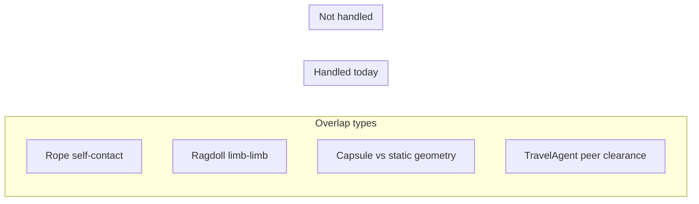
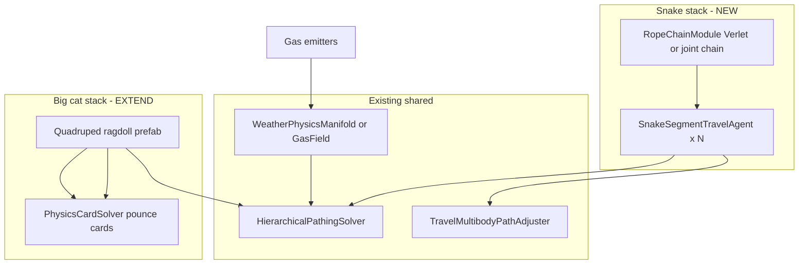

# Rope Physics, Self-Overlap, and Scene Pathing — Code Review

A review of how Drawer 2 handles **rope-like constraints**, **self-overlap**, and **pathing through a scene**—plus a stress-test scenario: a game about **farting snakes** pursued by **big cats**.

---

## Executive summary

| Question | Answer today |
|----------|----------------|
| Is there a 3D rope / cable / chain simulator? | **No** — only a 2D menu pendulum (`DistanceJoint2D`). |
| Does rope self-overlap work? | **N/A** — single link; no multi-segment self-collision. |
| How do agents path through scenes? | **Hierarchical grid/octree A\*** → multi-modal plan → **GoodSection** cards → ragdoll impulses; **Space** via medium registry (+ Planetary); optional **radiation-aware** rerouting for spaceship scenes. |
| How is overlap handled? | **Capsule agent** (pathing), **multibody lateral relaxation** (peers), Unity colliders (physics)—not rope self-contact. |

The locomotion stack is built for **humanoid ragdolls + physics cards + travel agents**, not serpentine chains. The sections below map what exists, what breaks for rope, and how an absurd party game would still get partial mileage out of the current architecture.

---

## 1. What counts as “rope” in this repo

### Implemented: menu pendulum (2D)

`MenuRagdollBase.EnsureHangingPhysics()` — rope-ladder-style main-menu hang:

| Piece | Mechanism |
|-------|-----------|
| Anchor | Static `Rigidbody2D` |
| Body | Dynamic plank + `BoxCollider2D` |
| Constraint | `DistanceJoint2D`, `maxDistanceOnly = true` |
| Interaction | `ApplySelectionImpulse()` — UI selection nudge |

**Path:** `Assets/SystemDrawer/Networking/MenuRagdollBase.cs`

**Self-overlap:** none — one body, one joint, no chain segments.

### Not implemented (would be needed for real rope)

- Multi-segment Verlet / PBD / XPBD chain
- Rope–rope or rope–self collision broadphase
- `Physics.IgnoreCollision` policy between adjacent links vs distant links
- Swept-volume pathing for a dangling tail
- `LineRenderer` + constraint solver coupling

### Near neighbors (often confused with rope)

| Feature | What it actually is |
|---------|---------------------|
| `TraversabilityMode.Swing` | **GoodSection** card bridge (ladder/swing *motion*), not rope sim |
| `RagdollFinger` / `RagdollDigit` | Semantic digit ordering on humanoid — not a simulated chain |
| Weather “Verlet” in docs | Precipitation comment/doc drift — not a locomotion constraint |
| `CausalityFamilyAudit.IsBisectingSnake()` | Network causality tree prefix check — **not snake physics** |

---

## 2. Self-overlap — how the stack responds

### A. Rope self-overlap (target behavior)

For a multi-link rope you typically want:

1. **Adjacent links** — no collision (or soft ignore) so joints don’t fight.
2. **Non-adjacent links** — collide so the rope can’t pass through itself.
3. **Stable tangling** — optional sleep/friction policy when coiled.

**Current state:** no rope module, so none of this is coded.

### B. Ragdoll self-overlap (character physics)

Humanoid ragdolls use Unity `Rigidbody` + `ConfigurableJoint` + `Muscle`:

| Layer | Self-overlap behavior |
|-------|------------------------|
| Colliders | Authored on prefab; hybrid auto-wire creates joints/muscles but **does not auto-add colliders** |
| Code policy | **No** `Physics.IgnoreCollision` between limb pairs in locomotion code |
| Contact pipeline | `RagdollSystem.GetPhysicsContacts()` returns **empty** (stub — expects future collision callbacks) |

**Implication:** limb–limb interpenetration is whatever Unity + prefab layers produce. Locomotion cards do not yet react to self-contact.

**Path:** `Assets/locomotion/RagdollSystem.cs`, `Editor/RagdollAutoWire.cs`

### C. Pathfinding “overlap” (planning, not rope)

`HierarchicalPathingSolver` treats the agent as a **capsule** (`agentRadius`, `agentHeight`):

```
Physics.CheckCapsule(p1, p2, agentRadius, obstacleMask)
```

Each grid cell is blocked or free. The planner does **not** know about:

- Ragdoll limb sweep volume
- Rope span or tail length
- Self-overlap of a convoy

**Path:** `Assets/HierarchicalPathFinding/HierarchicalPathingSolver.cs`

### D. Multibody / convoy overlap (peer separation)

When several `TravelAgent` instances share a route:

1. `TravelFormationPathOffset` — constant squad offset along the plan.
2. `TravelMultibodyPathAdjuster` — **lateral relaxation** vs peer polylines + dynamic actors near the path (`OverlapBox` cache).

This resolves **agent–agent** overlap along a polyline, not **rope–self** or **snake segment–segment** overlap.

**Paths:**

- `Assets/locomotion/travel/TravelMultibodyPathAdjuster.cs`
- `Assets/locomotion/travel/TravelNearPathActorCache.cs`
- `Assets/locomotion/docs/TravelFormation.md`



---

## 3. Pathing through a scene (end-to-end)

### Planning stack

```
Scene geometry + DoNotPathRegion + SpatialVolumeProvider + RoadCorridorMarker
        │
        ▼
HierarchicalPathingSolver.FindPath()     ← Walk / Fly / Drive; capsule agent
        │
        ▼
GenericTraversibilityPlannerSolver      ← Walk → Fly → Drive → tool bridge → acrobatics stub
        │
        ▼
TravelAgent.RebuildCachedPlan()         ← formation offset + multibody adjust + gizmos
        │
        ▼
CompositeMultiModalPathNode / PathfindingNode   ← BT spawns leg + waypoint children
        │
        ▼
MoveToWaypointNode / ExecuteToolTraversabilityNode
        │
        ▼
PhysicsCardSolver → GoodSection.Execute → NervousSystem → Muscle → Rigidbody
```

### Space pathing and radiation-aware rerouting (optional)

These sit **beside** the walk/fly/drive stack above—not inside rope physics, but relevant when reviewing “pathing through a scene” for vehicles or orbit gameplay.

| Layer | Mechanism |
|-------|-----------|
| **Space medium** | `PhysicalPathingMedium.Space` → straight-line stub, or Planetary great-circle when bootstrap registers `CurvedSpacetimeSd2PathingSolver` / `PlanetShellPathingSolver` |
| **Radiation-aware (optional)** | `RadiationAwarePathingSolver` in `Assets/locomotion/Spaceship/` — calls `HierarchicalPathingSolver.FindPath` for a base path, then offsets laterally to minimize `radiationVsTimeAlpha × ∫SampleRadiation·ds + (1−α) × distance` |
| **Scene hook** | `RadiationPathingOptions` MonoBehaviour; `radiationManifold` → `PhysicsManifold.SampleRadiation` (overridden on planet manifolds) |
| **Not wired to BT** | `PathfindingNode` / `GenericTraversibilityPlannerSolver` do not invoke radiation solver unless a spaceship component does |

For the *Farting Snakes vs Big Cats* stress test: cats use capsule + ragdoll pathing; neither snakes nor cats get radiation rerouting unless you add spaceship components and a radiation field (e.g. “toxic fart cloud” as manifold paint or `PhysicsPathingZone` is the more natural fit than `RadiationAwarePathingSolver`).

### Key review points for pathing

| Topic | File | Review note |
|-------|------|-------------|
| Shared solver mutation | `PathfindingNode`, `TravelLegDriveNode` | Temporarily sets `pathingMode` — risky if one solver serves many agents |
| Dynamic BT children | `PathfindingNode`, `CompositeMultiModalPathNode` | Runtime `AddComponent` / destroy — re-entry and GC |
| Tool bridges | `ToolTraversabilityPlanner`, `ExecuteToolTraversabilityNode` | Single-shot `card.Execute`; swing/climb are **cards**, not continuous sim |
| Stuck recovery | `MoveToWaypointNode` | Timer + impulse fallback |
| Narrative gap | `NarrativePathToAction` | Can find a path but does not drive waypoint BT execution |
| Formation MVP | `TravelFormationPathOffset` | Constant offset — corners may clip for wide bodies |

### Ambulation vs travel agent

| Role | Component | Review focus |
|------|-----------|--------------|
| **Ambulation** | `AmbulationCardClassifier`, `PhysicsCardSolver`, `ApplyRagdollLocomotionNode` | Filters cards to trunk/legs; motor impulses on `"Limb"` channel |
| **Travel preview** | `TravelAgent`, `TravelExecutionContext` | Cached plan, animation sets, multibody policy |
| **Player** | `FirstPersonRagdollControllerBehaviorTree.prefab` | Doc name only — no `PlayerRagdollController` class |

**Setup doc:** `Assets/locomotion/docs/PlayerRagdollControllerSetup.md`

---

## 4. Rope physics — code review checklist

Use this when adding or reviewing a real rope module:

### Self-overlap

- [ ] Adjacent link pairs excluded from collision (layer matrix or explicit ignore list)
- [ ] Non-adjacent segments on collision layers that interact with world + each other
- [ ] Broadphase budget when rope length × segments is large
- [ ] Coiled resting state — sleep thresholds, jitter

### Pathing integration

- [ ] Agent footprint: capsule vs ** swept polyline** (head + tail samples)
- [ ] `DoNotPathRegion` / SDF volumes for gaps the rope body cannot fit
- [ ] `TravelMultibodyPathAdjuster` extended for **linked segments** (snake train) vs independent agents
- [ ] Swing/card bridges: `TraversabilityMode.Swing` for grappling, separate from rope sim

### Locomotion coupling

- [ ] `GoodSection` with `TraversabilityMode.Custom` + tag for “slither” / “constrict”
- [ ] `ImpulseType.Motor` per segment or wave propagation down a `MuscleGroup` chain
- [ ] `RagdollSystem.GetPhysicsContacts()` populated if cards depend on touch

### Tests to add

- [ ] Self-crossing rope settles without explosion
- [ ] Path replan when tail blocks head’s corridor
- [ ] Multibody relaxation with N segment agents in one formation group

---

## 5. Case study: *Farting Snakes vs Big Cats*

A multiplayer chase game: **snakes** leave propulsive “gas” trails, **big cats** hunt on ragdoll quadruped physics through the same level.

Below: how **today’s** Drawer 2 systems would handle each fantasy mechanic—and where you’d extend.

### Cast mapping

| Character | Closest existing primitive | Gap |
|-----------|---------------------------|-----|
| **Snake body** | Convoy of `TravelAgent` peers OR single capsule agent | No chain constraint; tail doesn’t follow head physically |
| **Snake slither** | `GoodSection` + `Muscle` wave on many small RBs (manual rig) | No serpent solver |
| **Fart propulsion** | `MotorData.forceDirection` impulse or `Rigidbody.AddForce` on tail segment | No gas/fluid coupling in locomotion |
| **Fart cloud (gameplay)** | `WeatherPhysicsManifold` / egg zone OR trigger volume | Weather is meteorology, not comedy gas — but **field paint** pattern fits |
| **Big cat** | Humanoid `RagdollSystem` retargeted / quadruped prefab | Quadruped card library not default |
| **Cat pounce** | `TraversabilityMode.Throw` / custom acrobatics card | Planner stub for acrobatics |
| **Cat smell / avoid gas** | `PhysicsPathingZone` cost multiplier or `DoNotPathRegion` | Zones exist; dynamic fart fields need runtime rebuild |

### Scene pathing — chase sequence

**Snake escapes:**

1. `HierarchicalPathingSolver.FindPath` from head position with **`agentRadius` = snake girth** (not length).
2. `GenericTraversibilityPlannerSolver` picks Walk (or Fly if gas-lift joke leg).
3. `TravelAgent` preview; optional formation if “snake” is modeled as **squad of segment agents** with shared `multibodyFormationGroupId`.
4. `TravelMultibodyPathAdjuster` pushes segment agents apart — **approximates** a stretched body but doesn’t enforce spine curvature.

**Cat pursues:**

1. Same planner with larger `agentRadius` / height for big cat.
2. `PhysicsPathingZone` on gas trail — high edge cost or block when `confidence` low (mirrors multibody clearance lerp).
3. `MoveToWaypointNode` executes run/pounce cards; `Brain` gates BT on animation playback.

**What breaks without new work:**

- Snake **tail blocking a doorway** the head already passed — capsule pathing never sees the tail.
- Rope-like **self-tangle** on a coiled snake — no self-collision policy.
- **Fart as persistent AoE** — needs runtime grid invalidation or SDF volume register, not just one-shot impulse.

### Farting — three implementation tiers (review options)

| Tier | Mechanism | Fits existing code |
|------|-----------|-------------------|
| **1. Arcade** | Tail `AddForce` + audio + VFX; no pathing change | `NervousSystem` motor impulse, `EventData` |
| **2. Tactical** | Trigger collider → temporary `DoNotPathRegion` or `PhysicsPathingZone` | Pathing rebuild on marker add/remove |
| **3. Simulationist** | Paint low-density gas into `WeatherPhysicsManifold`; cats sample `GetDataAtPosition` | Same family as CloudBake / weather eggs; heavy |

**Impulse bus today:** only `Sensory` (up) and `Motor` (down) — `Assets/locomotion/ImpulseData.cs`. A fart is either a **motor** (propulsion) or an **event** payload on sensory channel (`Ears` already reflects on impulse types).

### Big cats — overlap with snakes

| Interaction | System behavior today | Game feel |
|-------------|----------------------|-----------|
| Cat capsule vs snake capsule | Grid cells blocked per agent; multibody relaxation separates **TravelAgent** roots | Cats don’t step on snake *body*, only peer centroids |
| Cat ragdoll vs snake RB pile | Unity collision if both have colliders | Works if snake is physical segments |
| Cat walks through gas | Only if gas doesn’t register as obstacle mask | Needs tier 2+ fart |
| Networked chase | `ServerOrchestrator` + lockstep decisions; causality “bisecting snake” is **tree integrity**, not creature sync | Multiplayer chase is supported at orchestrator level; rope state sync would be new |

### Recommended architecture for this game (if you built it for real)



**Minimal MVP using only existing systems:**

1. Snake = one **fat capsule** agent + fart = **`PhysicsPathingZone`** spawned behind.
2. Cat = **humanoid ragdoll** with larger capsule + run cards.
3. Multiplayer = existing **WeatherLodNetworkBridge** pattern for gas blobs if synced.

**Full vision:** add **RopeChainModule** (segment array + adjacency ignore + self-collision), register tail samples with pathing rebuild, emit gas via **manifold paint** or dynamic zones.

---

## 6. Review questions (presentation-ready)

1. **Rope:** Is menu `DistanceJoint2D` the only intentional rope, or is serpent chain on the roadmap?
2. **Self-overlap:** Who owns ragdoll limb ignore matrix — prefab author or `RagdollAutoWire`?
3. **Contacts:** When will `GetPhysicsContacts()` feed card feasibility?
4. **Pathing footprint:** Should `TravelAgent` expose **body extent** separate from planner capsule (tail, vehicle trailer)?
5. **Swing vs rope:** Is `TraversabilityMode.Swing` sufficient for grapple gameplay without rope sim?
6. **Multibody:** Can formation groups represent a **snake train**, or do we need segment constraints?
7. **Dynamic obstacles:** What rebuilds the path grid when fart zones appear mid-chase?
8. **Farting snakes:** Motor impulse, pathing zone, or weather manifold — which tier is the design target?
9. **Space vs radiation:** Is orbit/space travel using the Space registry, Planetary shell solver, or optional `RadiationAwarePathingSolver` wrapper?

---

## 7. Key file index

| Topic | Path |
|-------|------|
| Only rope-like physics | `Assets/SystemDrawer/Networking/MenuRagdollBase.cs` |
| Ragdoll + contacts stub | `Assets/locomotion/RagdollSystem.cs` |
| Physics cards / swing | `Assets/locomotion/GoodSection.cs` |
| Impulse bus | `Assets/locomotion/NervousSystem.cs`, `ImpulseData.cs` |
| Waypoint execution | `Assets/locomotion/nodes/MoveToWaypointNode.cs` |
| Tool swing/climb bridge | `Assets/locomotion/nodes/ExecuteToolTraversabilityNode.cs` |
| Grid pathing + capsule | `Assets/HierarchicalPathFinding/HierarchicalPathingSolver.cs` |
| Space medium registry | `Assets/HierarchicalPathFinding/PhysicalPathingSolverRegistry.cs` |
| Radiation-aware (optional) | `Assets/locomotion/Spaceship/RadiationAwarePathingSolver.cs`, `RadiationPathingOptions.cs` |
| Radiation sample hook | `Assets/Weather/PhysicsManifold.cs` |
| Multi-modal plan | `Assets/locomotion/travel/GenericTraversibilityPlannerSolver.cs` |
| Travel preview | `Assets/locomotion/travel/TravelAgent.cs` |
| Convoy overlap | `Assets/locomotion/travel/TravelMultibodyPathAdjuster.cs` |
| Formation | `Assets/locomotion/docs/TravelFormation.md` |
| Player BT setup | `Assets/locomotion/docs/PlayerRagdollControllerSetup.md` |
| Ragdoll AI plan | `.cursor/plans/ragdoll_physics_ai_system_plan.md` |

---

## 9. Implementation (Locomotion.Rope module)

Module path: `Assets/locomotion/rope/`

| Component | Role |
|-----------|------|
| `RopeSystem` | Orchestrator: wind → physics → tensile → cord → caches → audio |
| `RopeArcLengthState` | Wound/active arc-length window + pose bins |
| `RopeSegmentRingBuffer` | N-slot rigidbody ring; adjacent collision ignore |
| `RopeWindingController` | Signed wind/unwind rate |
| `RopeTensileModel` | Per-segment tension, total strength, snap |
| `RopeOverlapIndex` | Non-adjacent overlap + tangle flags |
| `RopeCordSolver` | Post-physics push-apart |
| `RopeRadialStrainCache` + `Shaders/RopeStrainRadial.shader` | Strain/twist UV cache |
| `RopeAudioMap` | Arc-indexed scrape/impact/snap |
| `RopePathingFootprint` + registry | Tail samples for multibody clearance |
| `ConsiderRopeCards` | Grapple / wind / climb / coil GoodSections |
| `TravelMultibodyPathAdjuster` | Optional rope footprint relaxation |

Demo: **GameObject → Locomotion → Rope System Demo** (writes `Assets/locomotion/rope/Prefabs/RopeSystemDemo.prefab`).

### Acceptance checklist (§4 updated)

- [x] Adjacent link pairs excluded from collision (`Physics.IgnoreCollision` for \|i−j\| ≤ 1)
- [x] Non-adjacent segments collide (active RB colliders enabled)
- [x] Ring buffer simulates only unwound window; wound segments deactivated
- [x] Wind/unwind moves arc head; tail pose stored in wound bins
- [x] Segment tensile strength + total break (weakest-link policy)
- [x] Radial strain cache + shader indexing
- [x] Overlap index for cord solving; invalidate on wind/snap
- [x] Audio map for collision/scrape/snap events
- [x] Path footprint samples + multibody hook
- [x] Consider rope cards (grapple, wind, climb, coil)
- [ ] Broadphase budget profiling at large N (future)
- [ ] Networking snapshot (documented out of scope)

Tests: `Assets/locomotion/Tests/Rope*.cs`

---

## 10. Bottom line

**Rope physics** now includes a **general-purpose Locomotion.Rope module** (ring-buffer rigid bodies, wind/unwind, tensile cache, overlap/cord solver, path footprint, Consider cards). The legacy **2D menu pendulum** (`MenuRagdollBase`) remains separate. **Scene pathing** still plans from a head capsule by default, but **`RopePathingFootprint`** publishes tail samples for multibody clearance when enabled.

For *Farting Snakes vs Big Cats*, serpent/grapple/spool modes share one core; tail-aware replanning and networked rope state remain follow-ups.
