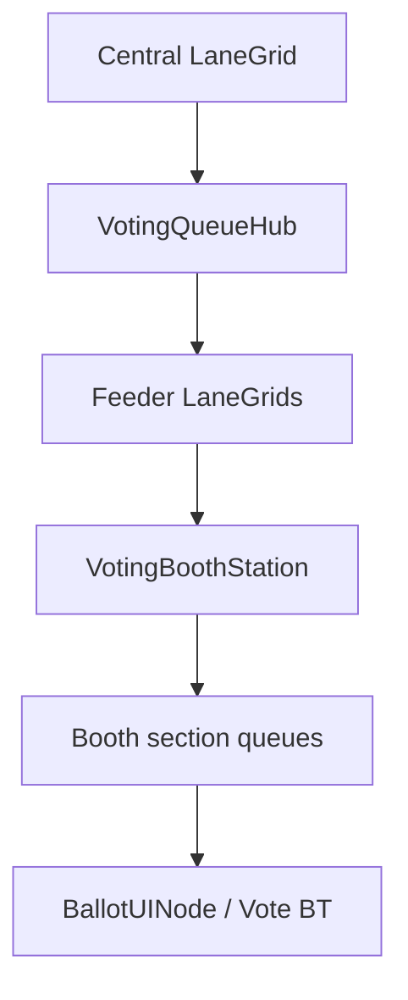

# Voting place, ballots, GameSession, and Game Lobbies

Polling places use `CivilSystemKind.VotingPlace` (ids `voting_place`, `polling`, `polling_station`) and also attach on `TownHall`. Bootstrap wires `LaneGrid`, `VotingPlaceBioRhythm`, `VoteLedger`, and `VoteBehaviorTreeNode`.

## Venue

`VotingPlaceBioRhythm` measures issued / cast / spoiled ballots and activates a perimeter **`VotingPlaceCard : JusticeCard`** (`SecureArea`). The card enqueues `BaseAmbulatingActor`s onto the **central** `LaneGrid` (pedestrian FIFO, not road lanes). `VotingQueueHub` advances the head of that ingress queue onto **feeder** `LaneGrid`s, then onto a **`VotingBoothStation`**.

Feeder list: developer-painted child `LaneGrid`s (and `feeder_queue` building slots). If none are painted, the hub synthesizes default feeders (at least one, or one per booth). Assignment is **queued by address, or randomly, if so**: `homeAddress` / `home-address` (`VotePropertyBag.HomeAddressKey`) hashed into a feeder, or **random** when that property is missing.

The default developer in-paint prompt is `VoteLemmaPropertyKeys.DefaultInpaintPrompt` (`queued by address, or randomly, if so`). `if` is a predicate in every operator position: prefix (`if no home-address property`), infix (`queued by address if home-address`), postfix (`randomly, if so` → `randomly-if-so`), circumfix (`if pause then forward`). `VotingQueueHub.ExecuteInpaintPrompt` runs it on the local `VotingPlaceSgNode` (Bedoga attaches the node after scene load).

`developerInpaint` still blocks auto enqueue, hub advance, and auto-vote BT. Painted feeder/booth grids stay listed so a developer can place actors on cells.

Each booth is a station (`StationKind.VotingBooth`) with a list of section queues: **Single**, **TwoSectionBackToBack**, **FourSectionDivided**. The hub sends a feeder head onto the shortest section of the wired booth; `TryOccupyHead` seats one occupant for the ballot UI.

`VoterCard` (`GoalType.Vote`) is high priority in `PhysicsCardSolver` (ahead of Civic/Civil) unless in-paint.

## Ballots and BT

`BallotSpec` kinds:

- **Measure** — yes/no passing **laws** (`law.{ballotId}`).
- **Question** — yes/no **jurisdictional** changes (`jurisdiction.{ballotId}`).
- **Candidate** — **electoral** (governor / office). No auto yes/no options. Tally method: `plurality` (default), **IRV** (single-winner ranked choice), or **STV** (multi-winner, Droop quota, `seats` ≥ 2). IRV/STV share an ordered ranking on each cast (`ranking_json` / `VoteCastRecord.ranking`); first preference stays in `optionId`. Measure/Question + ranked method is an error.

Kinds fold into `GovernmentFlavorMix` when they apply (republic/parliamentary civic mix, measures under junta). Elsewhere `BallotGovFold.ErrorsFor` / Continuuuum ballot `errors` list the mismatch (e.g. electoral under junta or real monarchy; ranked choice on a measure).

Options carry win/lose property assignments. **Ballot** UI (`BallotUINode.BallotLabel`) lists candidates, questions, or measures (`KindListLabel`).

`BallotUINode` (SG2D) hovers/confirms an option onto `VoteBehaviorTreeNode`. For IRV/STV, `Rank` appends the candidate list; confirm still sets first preference from the ranking. Causality gates: prior calendar `eventId`, webtop `toolUseGate`, open/close topology id + `openCloseUnlocked` (no Open.Runtime). Empty gates allow the vote.

`RankedTally` runs IRV (eliminate last, transfer until majority or two left) and STV (Droop `floor(valid/(seats+1))+1`, elect at quota, transfer surplus, else eliminate). Certify applies win-lists for every STV seat. Results store `{ method, seats, firstPreferences, winners, rounds }`.

`ElectorateDemographics` slices always sum to 1. Changing one share keeps that value and splits the remainder evenly across the others; leftover hundredths go to the last other slice. Default two-party from gov-glove `congressStability` / `lobbyistActivity`. Adding a slice uses that same remainder split. Tilt applies only when the actor has not already chosen. Demographics on a named ballot apply to that question and **follow-on votes** in the same GameSession (`game_session_vote_config`) unless the next ballot overrides slices.

`VoteRun` / `VoteResult` key off **`gameSessionId`**. Recount clones casts. Certify applies winner win-list and loser lose-list into `VotePropertyBag` and merges into the session vote config so the next ballot inherits certified properties.

Named ballots persist in Continuuuum `vote_ballots` (`GET/POST /api/votes/ballots`, `GET/DELETE /api/votes/ballots/<name>`). **Build ballot** copies a named spec onto a session (`POST /api/votes/ballots/<name>/build` with `gameSessionId`). Closing a session deletes that session’s runs, not the ballot catalog. **Remove ballot** deletes the named spec only.

`VoteBehaviorTreeNode.gameSessionId` is set from `GameSessionHost.ActiveId` (Networking binds the serialized string; Locomotion does not reference Networking). Named specs can be fetched then `VoteLedger.StartRun(activeId, spec)`.

## GameSession (inside lobby)

`GameSessionHost` on `ServerOrchestrator` creates sessions under `lobbySessionName`. Indexed BT/object tracking: switch by index/id **without a full reload** (dormant objects, trees `LocalOnly`).

Sessions form a pecking tree: `parentId` + `peckingOrder` (int, **lower = higher rank**, same lemma as kitchen/scribe). **New Game** under the active session sets `parentId = Active.id` and pecking after the last sibling.

**Close (adopt to higher):** children of the closed session are reparented to its parent, then only that session’s spawned entities are destroyed. Chain `A→B→C` with B closed becomes `A→C`.

**Umbrella close:** `CleanupForSessionClose` on the session and every descendant.

**Save to Local Client** writes server structure plus lobby prefab params (`game-sessions/{lobby}/{id}.json`, optional `.{playerId}.json` per player). Continuuuum lists session **players** and **Download local client data** returns that JSON from the player’s perspective (Unity file when posted, otherwise a review payload of transmitted session/prefab/player). The web button is not a substitute for the Unity client write.

Lockstep leaves: `vote.{gameSessionId}.{runId}.{actorId}`, scoped to the active GameSession.

## Continuuuum

Pages:

- `/votes` — Continuuuum header + page header. Lobbies listed like Game Lobbies (edit lobby modal, create session, nested sessions, manage players). **Ballot** editor (kind + candidates/questions/measures, demographics, gov mix, error output). Sessions show votes per player, demographic %, and individual actor votes.
- `/game-lobbies` — Continuuuum header + page header. Tabs **Configure & Create** | **Lobbies** | **Graph**. Query box (`q`, lobby, live, content kind) with pagination (`limit`/`offset`/`total`). Graph is pannable (d3 zoom).
- `/voting-places` — voting place config bound to **lobby id** (lobby instance name).
- `/players` — TBD roster page (opened from **Manage players**).

**Configure & Create** stores named **lobby configs** (templates): `lobbyTypeId`, content kind/id, game size, mode, min to start, password/spectator caps, `propertiesJson`. This is the designed surface.

**Lobbies** lists **instances** grouped by config. **Create lobby** copies the config snapshot into a new instance (`{configName}-{shortId}`). Many instances of one config may be `active`/`live` at once. Each instance has **Edit lobby** (modal: instance snapshot via PUT prefab), **Create session** (modal: display name, parent, pecking order), and a nested session tree. Close (adopt) vs umbrella close remain on sessions.

Graph is a D3 parent→child session tree (node color by lobby instance, pan/zoom); click a node to open Votes.

APIs: `/api/game-lobby-configs`, `/api/game-lobbies` (GET list/`?configId=`, POST spawn `{configId}` or Unity heartbeat with `name`+`sessions[]`), `GET /api/game-lobbies/<name>`, `PUT .../prefab` (instance snapshot), `POST .../close`, paginated `GET /api/game-sessions`, `GET /api/game-sessions/graph`. Heartbeat marks listed sessions `live=1` only on **that instance**. Config PUT does not rewrite running instance snapshots.

## Lobby prefab and Unity heartbeat

`LobbyPrefabParameters` (on `NetworkSettings` / `LobbyHostOptions`): `gameSize`, `minPlayersToStart`, `mode`, password/spectator caps, `lobbyTypeId` / `contentKind` / `contentId`, `propertiesJson`, **`configId` / `configName`**.

One Unity process hosts **one** lobby instance (`NetworkSettings.lobbySessionName`). Continuuuum can track many live rooms of the same config (several dedicated hosts).

`ServerOrchestrator.StartLobbyHost` ensures at least one GameSession, applies prefab caps/mode, and POSTs a heartbeat (plus ~5s while the lobby runs). `StopLobbyHost` POSTs lobby close. `HandleHello` enforces **player cap** as well as spectator cap.

Editor: **Lobby Prefab Sync** (`Window/System Drawer/Networking/Lobby Prefab Sync`) syncs from/to Continuuuum (GET config when `configId` is set, else GET instance) and Save to Local Client for every session. Game Sessions window has a **Graph** tab over the in-memory `parentId` tree.

**Master Rebake** (`MasterRebakeRunner`) shows `DisplayCancelableProgressBar` and `FindObjectsByType` (inactive included) for spatial/planet/road/SDF/hair/city/lobby bake targets. Per-instance failures log and do not abort. Buttons on the 4D Orchestrator inspector and Dedicated Server window.

## In-game MenuRagdoll

`LobbyTypeBinding` on `MenuRagdoll` / `MenuRagdollNode`: one UI → one lobby type (game mode / expansion / mod). `CanShow()` hides a mismatch with the active prefab content.

Game Sessions under Lobby: `game.session.new` (**New Game**), `.join`, `.spectate`, `.close` (adopt), `.close.umbrella`, `.save`. `lobby.game.start` / New Game going live is rejected until `playerCount >= minPlayersToStart` (`lobby.game.start.denied`). Host/join passwords and max players remain.

## Hub / budget / lemmas

Locomotion: Voting Place, Ballot UI, Vote Runs. Networking: Game Sessions, Game Lobbies, Lobby Prefab Sync. FeatureBudget `voting` rank 37.

Lemmas: `vote`, `ballot`, `recount`, `tally`; `queue`, `queued`, `address`, `home-address`, `randomly`, `happily`, `if-so`, `property`; `game-session`, `saving`, `loading`, `local-save`, `save-server-to-local`, `local-server`; `pecking-order` (existing).

Locomotion.Runtime does not reference Drink.Runtime or Open.Runtime. Crime stays stub.
